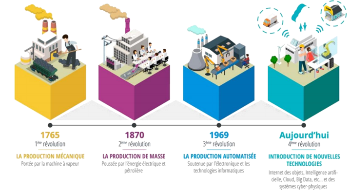
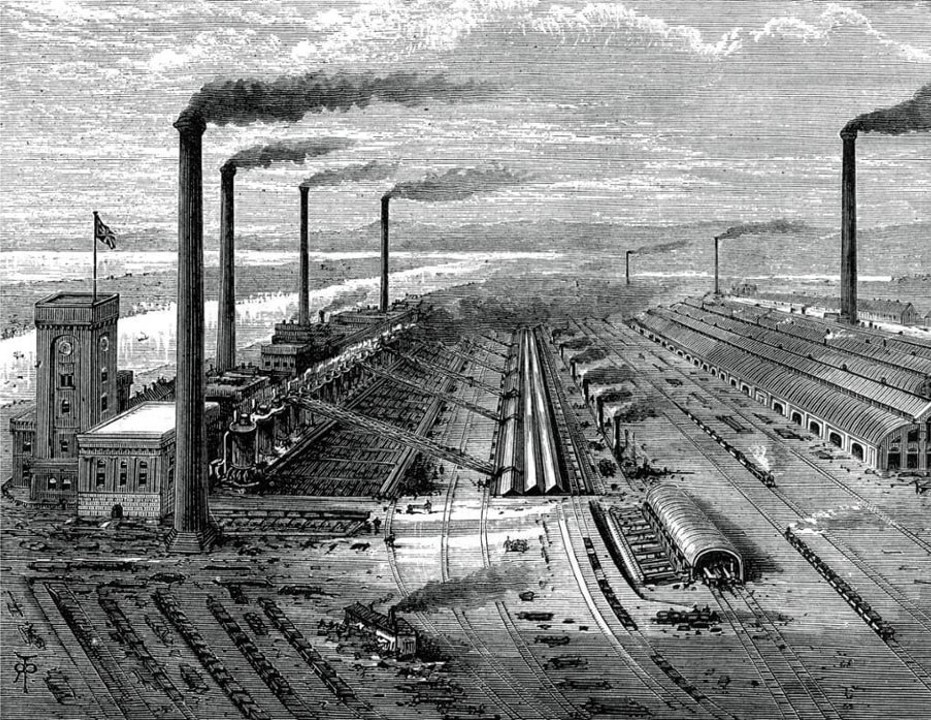
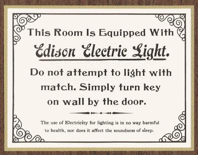
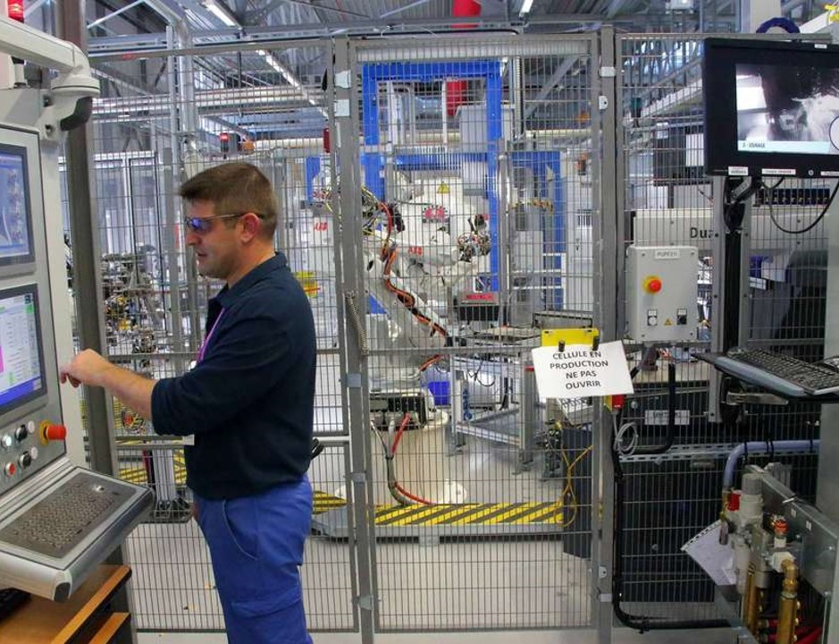

# Chapitre 1 : Contexte et définition

## 1. Une brève histoire de l'industrie

La transformation massive de l'industrie vers ce qui est appelé aujourd'hui l'industrie du futur ou industrie 4.0 est souvent définie comme la 4e révolution industrielle faisant suite à :

- la __mécanisation__
- la __production de masse__
- l'__automatisation__

Il est important de prendre du recul vis-à-vis de ces transformations pour comprendre et réussir la transition en cours.
D'abord, ces révolutions ne sont pas aussi soudaines qu'il n'y parait. Chacune d'entre elles ont été initiée par les avancées lentes et minutieuses des sciences. Parfois accentuée par le contexte politique locale, elle reste principalement liée à l'histoire des sciences et techniques. Notons aussi que ces révolutions ne touchent pas tout les secteurs et tout les pays en même temps.

### 1.1. La mécanisation

La première révolution industrielle commence au __XVIII siècle__. Propulsé par l'exploitation du __minerai de charbon__ (La houille) permettant la production de vapeur d'eau, le XVIII siècle est alors le théâtre des plus importantes innovation en mécanique (machine à tisser, locomotive à vapeur...).

En commençant par la mécanisation de la filature puis du tissage en passant par les __machine à vapeur__, les manufactures isolées deviennent des usines mécanisé permettant de produire plus et plus vite. L'Homme est appuyé par la machine dans son labeur.
Cette première révolution industrielle se propage de la Grande-Bretagne à la France au début du XIXe siècle, avant de s'étendre à l'Allemagne, l'empire Russe ainsi qu'aux états-unis et au Japon.

Les manufactures locales sont alors transformées en usine de plus grande envergure regroupant des centaines de travailleurs. Notamment, grâce aux voies de chemin de fer, les marchandises et les ouvriers peuvent être acheminé directement sur les sites de production.

### 1.2. Production de masse

Au début du XIXe siècle, le monde assistera à une deuxième révolution industrielle portée une fois de plus pas les innovations techniques et scientifiques.
Le XIXe marquera le début d'une course à l'innovation qui n'a cessé d'accélérer. Il sera le siècle des pionniers, et des grands inventeurs.
L'usage du gaz et du pétrole se généralise grâce à la mise au point du moteur à explosion (fin du XIXe).

Les innovations en métallurgie et en chimie de synthèse viennent elles aussi moderniser l'industrie.
Cette révolution est marquée par l'accroissement du rôle joué par la recherche et les capitaux. C'est l'avènement des grandes usines symbole du modèle d'organisation productive.

<figure class="image">
  
  <figcaption>Instruction pour allumer un ampoule à incandescence</figcaption>
</figure>

La propagation du réseau électrique donne plus de liberté pour rationaliser l'organisation spatiale des usines de façon strictement conforme aux étapes de fabrication du produit. C'est l'apparition du Taylorisme et des chaînes de montage.

<figure class="image">
  
  <figcaption>Chaine de montage des voiture Ford (1908)</figcaption>
</figure>

Bien que les véhicules de la chaîne de productions Ford soit acheminé d'un poste de travail à l'autre grâce à un rail, la totalité des opérations de montage sont réalisé manuellement.

### 1.3. Production automatisée

Amorcée dès 1969, cette nouvelle étape dans l'histoire des sciences et des techniques est appuyée par l'utilisation d'une énergie nouvelle : l'Energie nucléaire. Mais ce n'est pas elle qui marquera profondément l'industrie.
Cette période sera profondément marquée par l'invention des circuits intégré puis du microprocesseur. En effet c'est le début de l'automatisation.
Le développement de l'électronique et de l'informatique rendent possible la production de composants miniaturisée de façon totalement automatisée.
Cette période verra naître les premiers robots industriels encore utilisé aujourd'hui.

La production automatisée décrit un processus quasi-autonome de fonctionnement de l'usine. Pour autant, les opérateurs ont toujours un rôle majeur dans l'usine. Il contrôle, paramètre et accompagne les cellules de production.
Cependant les opérations de montage, peinture, assemblage, soudage ... Sont désormais assurée par des machines automatiques, soulageant ainsi les ouvriers, tout en améliorant la qualité des produits.

### 1.4. Industrie du futur

La 4ème révolution industrielle n'est pas seulement caractérisée par nos avancées technologiques. Elle est caractérisée par le fait que nos technologies évoluent désormais de manière exponentielle.
Il ne s'agit plus d'intégrer les nouvelles technologies à l'industrie, il s'agit d'intégrer l'innovation technologique dans la gestion de l'entreprise.

Toute la finesse de cette transition vers l'industrie du futur réside dans le fait qu'il faut distinguer parmi toutes les innovations de rupture apportée par le numérique, les révolutions plus profondes, ces révolutions que modifiera à long terme notre organisation de travail.
Il nous faudra également identifier les méthodes qui rendront notre industrie agile, adaptable aux innovations susceptible d'apparaître brutalement.

## Les enjeux de l'usine du futur

### L'usine numérique dans le monde

Contrairement aux précédentes révolutions industrielle, la quatrième touche presque le monde entier simultanément.
En France la transition vers le futur de l'industrie est propulsé par un projet nationnal appelé [Industrie du futur](https://www.economie.gouv.fr/lancement-seconde-phase-nouvelle-france-industrielle). Plus localement, dans les Hauts-de-france il s'agit du programme [Rev3](https://rev3.fr/).

Le projet industrie du futur est prévu pour s'interfacer avec le projet de modernisation bien plus important mené par l'allemagne souvent considérer comme un des leader de la modernisation de l'industrie.
En effet l'industrie représente 28% du PIB allemand, industrie qui a profité d'une relance économique après la deuxième guerre mondiale permettant de faire de l'allemagne un des piliers industriel européens. Toutefois, malgré ce qu'on entend souvent, l'allemagne n'est pas le plus gros industriel mondiale. Les entreprises américaines et chinoise en revanche apparaissent très régulièrement dans le haut du classements, tout comme, plus largement les entrerpise de l'union européene.

Comparativement, l'industrie en france ne représente que 12% du PIB national en effet, d'autre secteur comme le commerce, y occupent une place plus importante.
L'industrie française est veillissante et c'est d'ailleurs ce constats qui est à l'origine du programme national __industrie du futur__ qui a pour objectifs prioritaire de renouveller le parc industrielle et de se réaproprier nos moyen de production.

Même si le numérique fait partie intégrante de la vie du grand public, ce n'est que le début de son intégration dans l'industrie. Bien souvent, les responsable de site de prodution son conscient de la neccessité de moderniser les sytemes de production, pourtant ils manque souvent de méthode et de recul sur les technologie qui peuvent être utiliser pour gagner en __performance__, en __agilité__ et pour créer des usines __responsable__.

__A retenir__ : 

- L'allemagne à la pointe de l'industrie 4.0 en europe
- Les états unis concerve une certaine avance malgré un effort centré sur internet
- La chine envisage sérieusement de devenir le premier producteur mondiale
- La France accuse un léger retard comparativement à sa place de 7e puissance économique.

### Les enjeux de l'industrie de demain

Le principale défi que pose l'industrie du futur est basé sur une loi bien connu, la loi de Moore. Gordon Moore, ingénieur et homme d'affaire dans les années 70s à fait un constat encore valable aujourd'hui, le nombre de composant dans les circuits intégré double chaque année. Plus tard il corrigera sa loi avec une période de 2ans (x2 tout les 2 ans).
Depuis cette loi d'évolution n'a que très légèrement ralentit et nous continuons à miniaturiser les circuits imprimé. Rendant les ordinateurs de plus en plus puissant.
D'un manière générale on peut désormais dire que l'innovation technologique est devenu exponentiel. Ce n'est donc plus les solutions technologique qu'il faut intégrer à l'industrie mais l'innovation elle même afin de rester compétifif.

Heuresement plusieurs études existe afin d'identifier les technologie mûre des technologie balbutiante, sans quoi il peut parfois être difficile de s'orienter.
L'institut Gartner publie annuellement un graphique au nom évocateur : Le cycle du hype.
Ce graphe simple permet d'identifier très rapidement l'état de maturité d'une technologie. On remarque que bien souvent, on entend parler dans les médias d'une technologie puis elle tombe rapidement dans l'oublie avant de faire un retour plus timide une fois arrivier à maturité.

Notons bien que ce n'est pas parce qu'une technologie est populaire qu'il est pertinent de l'utiliser. En revanche il est important d'intégrer un programme de veille technologique afin d'identifier au plus tôt les technologie dont une entreprise peu tirer avantage.

__A retenir__ : 

- L'usine du futur c'est une usine : 
    - Performante -> Pour la compétitivité
    - Responsable -> Climat, respect des salariés
    - Agile -> Capable de s'adapter facilement 
- Les tendances suivent le cycle du hype (Gartner)
- L'innovation est exponentiel (Loi de moore)

### Nouveaux mode de consommation

Comme nous le disions en introduction, les modes de consommation évolue avec la société et l'industrie avec elles.
En effet, le consommateur est désormais plus exigeant qu'autrefois, d'abord un critère qui transforme massivement l'industrie, c'est la volonté de personnalisation.
Le client ne souhaite plus profiter du même produit que tout les autre (production de masse) mais preferera plutôt un bien personnalisé à son usage et à son goût.
Depuis quelques année ce changement est frappant sur les site des constructeur automobile et avec l'apparition des configurateur. Permettant de chsoisir son moteur, la couleur de la peinture, des sièges et même les modalité de réglement. Nous voulons du sur-mesure.

Ensuite le consommateur est désormais plus regardant sur la qualité des produit qu'il   consomme. Avec l'avènement des avis sur internet il est désormais plus facile de comparer les produit ou de faire savoir lorqu'un produit ne nous apporte pas satisfaction. La qualité déjà importante devient crucial pour les entreprise.

Enfin, avec l'avènement des achats en ligne, le suivi en temps réel de la production est désormais une option rassurante pour les clients.

__Pour résumé__ : 

- Suivi en temps réel
- Produit personnalisé
- Produits de meilleurs qualité

### Une usine performante
Par performance l'on imagine souvent des cadences de production très élevé. Pourtant ce n'es pas neccessairement le cas.
La performance industrielle vise à rechercher l'excellence opérationnelle. Pour l'atteindre, il faut réduire les coûts tout en augmentant la qualité des services et des produits.
Ainsi la performance n'est plus lié seulement au cadences de productions mais aussi à la qualité, la pertinence des produits vis à 

- Supprimez l'inutile
- Fluidifier les communications
- Préventions des pannes
- Optimisation de la supplychain (circuit court)
- Partage des données (Fournisseur <-> Entreprise)

#### Une usine responsable
- Enjeux environnementaux
- Le bilan carbone (Taxe)
- Usine éthique

#### Une usine agile
- Innovation continue
- Amélioration continue
- Réactivité
- L'usine modulaire (reconfigurable)

#### Les axes de travail
- Produit connectée
- Usine connectée
- Maintenance prédictive
- Piloter les usines :
    - Suivi du parc machine
    - Gestion de la consommation
    - Optimisation et sécurisation
    - Allocation dynamique des ressources
    - Adpatation rapide de la production
    - Optimisation de la supply chain
    - Amélioration continue
    - Maitrise du risque

- Décloisonner les activités
- Aide à la décision
- Simuler l'usine
- Piloter l'usine
- Réduire la pénibilité
- Sécuriser les données et le process