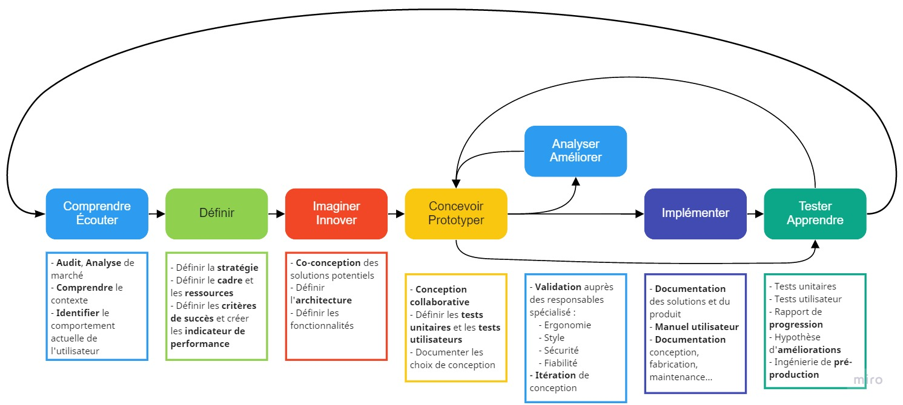

# 3.1. Maquette numérique

Aussi appelée Digital Mock-up, la maquette numérique d'un produit ou d'un système est, comme son nom l'indique, une version virtuelle d'un composant, d'un système ou d'un environnement.
La maquette numérique est utilisée depuis plusieurs années pour accélérer les cycles de conception produit. Elle permet notamment de s'affranchir du prototype physique pendant les phases d'étude préliminaire et de conception détaillée.

Aujourd'hui, les maquettes numériques peuvent être obtenues de plusieurs manières.
Il est possible de réaliser un modèle réel que l'on numérisera par la suite au moyen de scanner 3D.
Ou, de manière plus conventionnelle, en concevant le modèle numérique à partir de plan ou de croquis en utilisant un logiciel de conception sur ordinateur (CAO).

Bien que la conception numérique soit très largement répandue dans les bureaux d’étude de conception, les ingénieures styles et les ergonomes, utilise toujours le maquettage en argile (Plastilline) afin de concevoir l’esthétique des produits.

Après avoir dessiné la ligne et défini le style, la maquette en argile est ensuite scannée pour obtenir sa maquette numérique.
Ce processus de développement est plus adapté pour les stylistes et correspond plus à une démarche artistique. Il est possible que plusieurs maquettes en plastilline voient le jour avant le concept final du véhicule.

[Exemple Citroën Cactus](https://www.largus.fr/actualite-automobile/citroen-c4-cactus-video-de-ceux-auxquels-vous-avez-echappe-6307387.html){.md-button .md-button--primary}

## Processus de gestion projet de conception : 

Que l'on conçoive une voiture, un téléphone portable ou un jumeau numérique, le processus de conception est toujours significativement semblable :

Les projets de conception en particulier nécessitent une bonne organisation. Contrairement à d'autres projets, en conception, il est très facile de s'éloigner de ses objectifs. Objectifs qu'il est crucial de bien définir.

Généralement, on parle de performance de conception pour évaluer la performance d'une équipe d'ingénieur en bureau d'étude. La performance en conception est principalement liée au critère suivant :

- Précision du cahier des charges
- Communication au sein de l'équipe
- Répartition des rôles au sein de l'équipe
- Continuité numérique des logiciels utilisés
- Gestion des versions de conception
- Architecture produit
- Nombre d'itération de conception (Test -> Validation -> Modification -> Test -> ... )
- Complétude du produit. (pertinence de la solution vis-à-vis du cahier des charges)

Tous ces critéres sont des éléments mesurables permettant d'effectuer rapidement un diagnostics de la performance en conception.