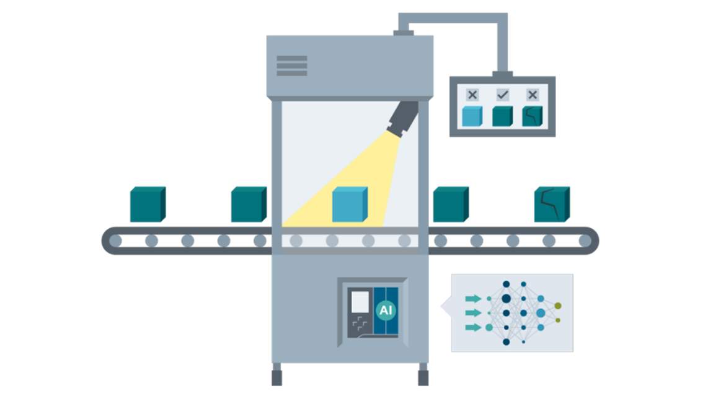
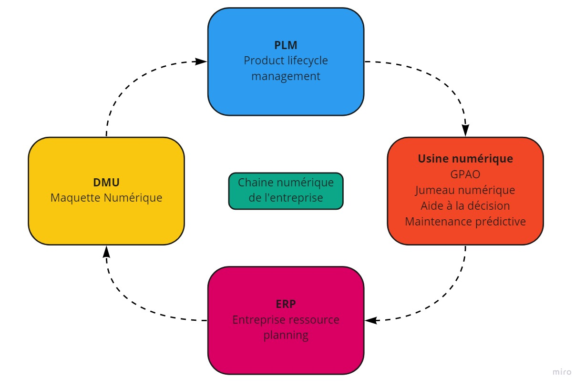

# 3.2. Jumeau numérique

Contrairement à la maquette numérique du produit évoqué précédemment, le jumeau numérique est une version virtuelle d'un produit ou du système de production qui interagît avec le système réel.
Ce jumelage permet entre autres de :

- __Valider__ la fabricabilité du produit au plus tôt dans le processus de conception,
- __Optimiser__ la performance et la flexibilité du système de production,
- __Communiquer__ plus rapidement en fluidifiant les échanges d'informations au sein de l'entreprise,
- __Piloter__ en utiliser les outils d'aide à la décision et simulant des scénarios,
- __Anticiper__ les arrêts non planifié de la chaîne de production en détectant les dérives.

## Jumeau numérique du système de production

Dans le cycle de développement des produits, pendant la phase de pré-production, les produits sont testé de façon à valider les performances, les normes de sécurité et d'évaluer la fiabilité des éléments du produit.

On peut distinguer le jumeau numérique du système de production des jumeaux numérique du produit.
Le premier permet de pré-concevoir l'usine, les programmes automate et les éventuelles modifications de la ligne de production. Il permet aussi de créer des supervisions plus précise en couplant les données du système réel (IIOT) avec une simulation physique.

Il est aujourd'hui possible de simuler les automates (API) qui agiront comme des automates réels, les capteurs, les actionneurs, et même les opérateurs (Simulation ergonomique).
Notons aussi que les automates virtuels permettent de programmer plus rapidement en s'affranchissant d'une platine électrique physique. Il est possible de tester son programme pendant la conception plutôt que lors de la mise en service.

??? summary "Pour résumer"
Les usages du jumeau numérique du système de production :

- Modélisation du système de production
- Simulation physique de la ligne
- Supervision précise en temps réel
- Reconfiguration, rétrofit, conception virtuelle
- Simulation d'ergonomie opérateurs

Le jumeau numérique du système de production vient compléter la chaîne numérique de l'entreprise, il doit s'intégrer parfaitement aux autres solutions logicielles de l'entreprise afin de conserver une continuité de la donnée numérique.

Voici quelques mots clés en ligne avec ce thème : 

- Automate virtuel
- Virtual commisionning
- Modélisation du système de production
- Supervision
- Production modulaire
- Ergonomie

## Jumeau numérique du produit

L'autre type de Jumeau numérique permet de simuler un produit couplé à sa version réel. Ce type de configuration permet par exemple de prendre le contrôle d'un équipement à distance ou encore de prédire des pannes d'un équipement à distance. Ce type de configuration est de plus en plus utilisé dans l'automobile afin de profiter de limiter les tests sur circuit au profit de données de terrain recueillis directement par les utilisateurs.

Dans le cycle de développement des produits, pendant la phase de pré-production, les produits sont testé de façon à valider les performances, les normes de sécurité et d'évaluer la fiabilité des éléments du produits.

[ Aire de test PSA ](https://www.google.com/maps/@47.4705218,6.8041404,2378m/data=!3m1!1e3){.md-button .md-button--primary}{.md-button}

[Article : Tesla continuous improvements](https://www.tesmanian.com/blogs/tesmanian-blog/tesla-model-y-top-10-takeaways-from-sandy-munro){.md-button}

<iframe width="878" height="494" src="https://www.youtube.com/embed/shjUk1C-Wko" title="YouTube video player" frameborder="0" allow="accelerometer; autoplay; clipboard-write; encrypted-media; gyroscope; picture-in-picture" allowfullscreen></iframe>

