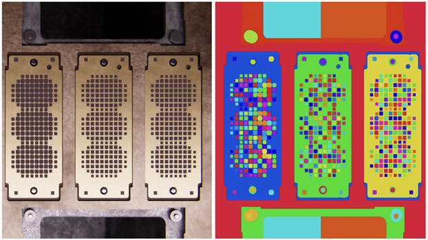
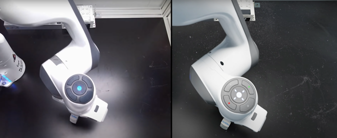
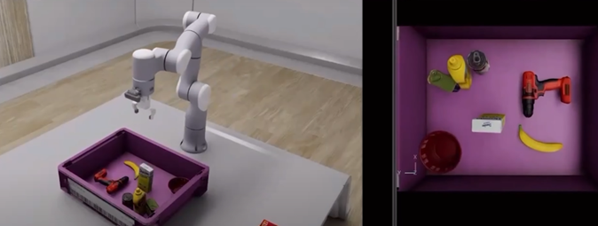

## Robotique et Cobotique
La robotique et la cobotique sont des éléments clés de l'industrie du futur, offrant des solutions innovantes pour automatiser et optimiser les processus de production.

### Robotique Moderne

La robotique moderne a évolué pour s'adapter et fonctionner efficacement dans des environnements complexes et dynamiques. Cette évolution est largement due à l'intégration de l'intelligence artificielle (IA) et de la vision par ordinateur.

#### IA dans la Robotique Moderne

L'intelligence artificielle a transformé les capacités des robots, leur permettant de prendre des décisions autonomes et d'apprendre de leurs expériences. Voici quelques exemples :

- **Apprentissage et Adaptation :** Les robots modernes, équipés d'IA, peuvent apprendre de nouvelles tâches et s'adapter à des changements d'environnement. Par exemple, un robot utilisé dans l'assemblage peut apprendre à reconnaître différents composants et ajuster ses mouvements en conséquence.
  
- **Optimisation des Processus :** Les robots IA peuvent analyser des données en temps réel pour optimiser les processus de production. Par exemple, ils peuvent ajuster automatiquement leur vitesse ou leur itinéraire pour maximiser l'efficacité.

#### Vision par Ordinateur

La vision par ordinateur permet aux robots de "voir" et de comprendre leur environnement. Cela a des implications importantes :

- **Reconnaissance et Tri des Objets :** Dans les chaînes de montage, les robots équipés de vision par ordinateur peuvent identifier et trier différents objets, augmentant la précision et réduisant les erreurs.
  
- **Navigation Autonome :** Dans les entrepôts, les robots utilisent la vision par ordinateur pour naviguer de manière autonome, évitant les obstacles et optimisant les itinéraires de livraison.

#### Avant et Après : Comparaison

- **Avant :** Les environnements industriels étaient statiques et les robots devaient être programmés pour des tâches spécifiques. Les changements dans l'environnement ou dans les tâches nécessitaient une reprogrammation manuelle.

- **Après :** Avec l'IA et la vision par ordinateur, les robots peuvent opérer dans des environnements dynamiques. Ils s'adaptent aux changements, apprennent de nouvelles tâches et interagissent de manière plus naturelle et efficace avec leur environnement et les humains.

En somme, la robotique moderne, grâce à l'IA et à la vision par ordinateur, a créé des possibilités quasi illimitées pour des applications industrielles plus intelligentes, flexibles et efficientes.

### Cobotique

La cobotique, ou robotique collaborative, désigne l'utilisation de robots conçus pour interagir directement avec les humains dans un espace de travail partagé. Contrairement aux robots industriels traditionnels, les cobots sont plus petits, plus flexibles et équipés de capteurs pour assurer la sécurité des travailleurs. Ils sont idéaux pour des tâches telles que le montage, le chargement et déchargement de pièces, ou l'assistance dans des tâches répétitives.

### AGV (Automated Guided Vehicles)

Les AGV sont des véhicules automatisés utilisés pour transporter des matériaux autour d'une usine ou d'un entrepôt. Ils suivent des itinéraires prédéfinis, utilisant des technologies telles que la vision par ordinateur, les capteurs de navigation, et l'IA pour se déplacer de manière autonome. Les AGV améliorent l'efficacité logistique et réduisent les coûts de main-d'œuvre.

### Exosquelette

Les exosquelettes dans l'industrie sont des dispositifs portables qui assistent les travailleurs dans l'exécution de tâches physiquement exigeantes. Ils offrent un support musculaire et articulaire, réduisant le risque de blessures et augmentant la productivité. Les exosquelettes sont particulièrement utiles pour des tâches comme le levage de charges lourdes ou les travaux en hauteur.

Chacune de ces technologies joue un rôle crucial dans la transformation de l'industrie, rendant les processus de production plus efficaces, sûrs et adaptatifs aux besoins changeants du marché.