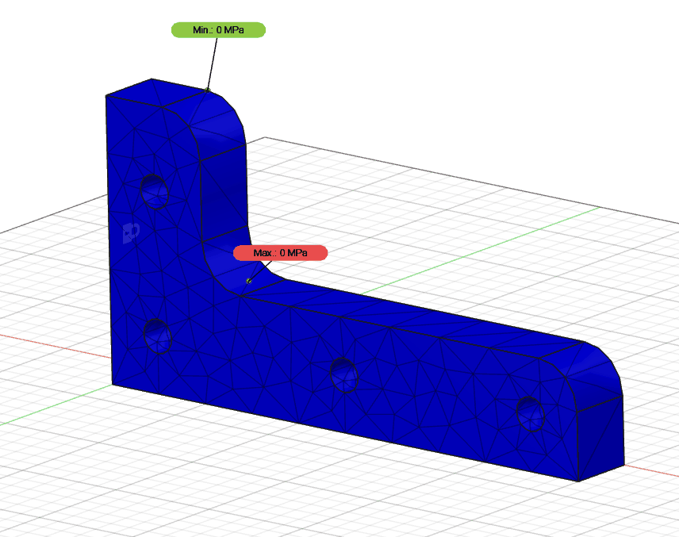

# Notion de simulation

Une simulation physique (numérique) définie une série de calculs réalisés par un ordinateur afin de reproduire un phénomène physique.
La plupart du temps, on simule le comportement d'un système au cours du temps. On va alors tenter d'analyser l'état du système à un instant `t` dans la simulation.
Cet état peut être représenté sous forme de données, d'une animation, d'une image ou d'une vidéo.

Un simulateur peut réagir à des modifications de paramètres et modifier ses résultats en conséquences. Il existe de nombreux simulateurs différents. Les jeux vidéo exécutent généralement une simulation physique plus ou moins réaliste aussi appelé moteur physique.

En ingénierie, on va tenter d'utiliser les simulations non pas pour visualiser un phénomène physique, mais plutôt pour dimensionner des systèmes complexe qu'il est difficile de résoudre analytiquement.
On va souvent utiliser les simulations pour résoudre des phénomènes physiques complexe modélisé par des équations différentielles.
Notons qu'il est fort utile de modifier les paramètres de l'environnement au grès de ses besoins. Par exemple, il est possible de faire subir à une structure des vents violents qui ne se produirait que rarement en réalité.

Les équations qui modélisent la mécanique des solides et des fluides par exemple sont souvent simulées grâce à la méthode des éléments finis.
Le principe de la méthode d'analyse par élément finie consiste à transformer une série déquation différentiel continu en problème discret.

!!! summary "Pour résumer"
    Pour résumer on peut dire que les simulations physique sont des algorithmes d’approximation et de discrétisation des modèles physiques continus.

Bien que les simulations physique puisse être utilisé pour dimmensionner des produits, elle sont aussi très efficace pour comprendre et vérifier des hypothèses. De plus en plus utilisé dans les universités comme support de cours les simulations physique permettent de concrètiser les modèles mathématiques.

Vous trouverez une liste de simulations physique en ligne en cliquant sur le bouton ci-dessous : 

[Phet simulation library](https://phet.colorado.edu/fr/){.md-button .md-button--primary}

