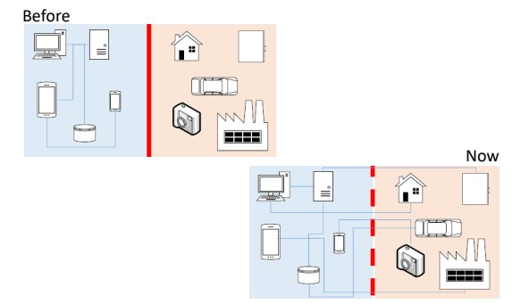
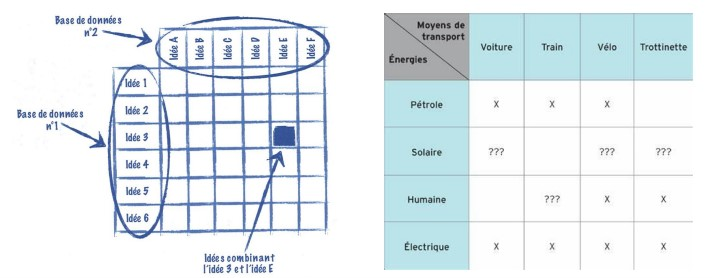

# Managment de l'innovation

Comme vu précédemment, l'innovation suit une croissance exponentiel depuis un peu plus de 30 ans. Cette croissance exponentiel implique d'intégrer l'innovation à la gestion d'entreprise. En outre de faire du managment de l'innovation.

Les systèmes cyberphysique que nous tendons à utiliser pour moderniser l'industrie sont un ensemble de solutions technologique qui interragissent ensemble. On retrouve par exemple les IIOT, les robots, Cobots, les logiciels Scada, MES ...

Cette architecture interconnectée simplifie les processus, le travail des collaborateurs ... Mais complexifie grandement l'architecture en elle même.
Pourtant, si vous proposez une telle architecture même si cela reste pertinent vis à vis du process, il y a de grande chance pour que le projet n'aboutisse pas.

Pour réussir la transisition numérique, il faut décloisonner les domaines d'expertise.
Il faut d'abord réussir sa transition de l'ingénieurie vers l'ingénieurie collaborative.

[Ingénieurie collaborative](./projet.md){.md-button}

## Méthode de gestion de l'innovation

### L'analyse SWOT :

### La matrice de découverte

### Analyse des risques
[Analyse des risques](https://fr.wikipedia.org/wiki/Analyse_des_risques)

## La culture d'entreprise

Les Fablabs :

Animer l'innovation neccessite un lieu et des outils pour innover.

[Makerspace Unilasalle](https://makerspace-unilasalle.gitlab.io/campus-amiens/hub-amiens/){.md-button .md-button--primary }

## Opensource
L'innovation ouverte est une méthode d'innovation basé sur le partage des connaissances. Plus qu'un label, l'opensource est un mouvement internationnal qui regroupe de plus en plus d'adepte.

Pour faire simple, l'opensource c'est le partage gratuit des documents, fichier, méthode permettant de refaire un produit, un procédé, une recette. Ce produit peut lui même comporter des composants réalisé grâce à un autre projet opensource.

Il s'agit d'une collaboration internationnal autogéré permettant d'innover rapidement en tirant profit de l'intelligence collective.

Attention toutefois au licence de partage !

## Documentation

- Documentation adjacente
- Crowdsourcing
- Business model
- Design thinking [Wiki](https://fr.wikipedia.org/wiki/Design_thinking)
- Living lab [Wiki](https://fr.wikipedia.org/wiki/Living_lab)
- Brainstorming & Challenge storming