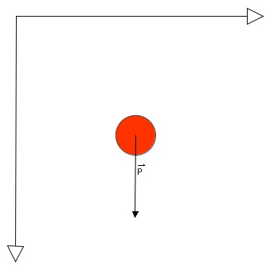

# TD 1 : Notion de simulation

Afin de comprendre le fonctionnement sous-jacent des simulations numériques, nous proposons dans ce TD d'étudier quelques méthodes de simulation numérique.
En guise d'introduction nous étudirons un système simple : une balle en chute libre.

Afin de simplifier d'autant plus les équations, nous travaillerons en 2D.

Pour décrire l'évolution de notre balle au cours du temps, nous lui attriburons comme propriété évidente, une position, une vitesse et une accélération et une masse.

- Position : $U(t)$
- Vitesse : $V(t)$
- Accelération : $A(t)$
- Masse: $m$

\begin{align}
        \vec{U} &= \begin{bmatrix}
            u_{x} \\
            u_{y} \\
            u_{z}
            \end{bmatrix}
        &\vec{V} &= \begin{bmatrix}
            v_{x} \\
            v_{y} \\
            v_{z}
            \end{bmatrix}
        &\vec{A} &= \begin{bmatrix}
            a_{x} \\
            a_{y} \\
            a_{z}
            \end{bmatrix}
\end{align}

Commençons par effectuer le bilan des actions mécaniques exterieurs appliquées à la balle.

{.align-left}

A la surface de la terre, notre balle est soumis à un champs de pesanteur de magnitude $\vec{g} =~ 9.81 . \hat{y}$

#### Question 1

En partant du principe fondamentale de la dynamique $\sum_{}^{} {\vec{F_{ext}}} = m . \vec{a}$
Écriver les équations de mouvement de la balle $\vec{U(t)}$ et $\vec{V(t)}$.

#### Question 2

En utilisant l'algorithme d'intégration de Euler, donner le shéma itératif de la vitesse et de la position.

$$
\begin{cases}
V_{n+1} = \dots\\
U_{n+1} = \dots
\end{cases}
$$

#### Question 3 

Écrivez l'algorithme permettant de simuler la chute de la balle.

#### Question 4

Nous souhaitons maintenant prendre en compte les frottements de l'air.
Nous utiliserons un modèle simplifier des frottements de l'air agissant sur la balle.
La force de frottement (drag force) sera défini par $\vec{F_d} = \alpha * \vec{V}$
Où $\alpha$ est le coeficient de frottement.

Donner l'équation de l'acceleration en utilise le principe fondamental de la dynamique.

#### Question 5

Comment peut-on prédire analytiquement la vitesse final de la balle lorsque $t\to\infty$

??? "Indice"
    Comme les forces de frottements dépendent de la vitesse, lorsque $t\to\infty$, le poids de la balle est contrebalancé par les frottements. On a alors la relation $\vec{F}_{frottements} = \vec{P}$

#### Question 6

Donner alors le schéma itératif de la balle en chute libre soumis aux frottements et au champs de pesanteur.

$$
\begin{cases}
V_{n+1} = \dots\\
U_{n+1} = \dots
\end{cases}
$$

#### Question 7 : 
Écrivez l'algorithme permettant de simuler la chute de la balle.

#### Question 8 : 
Comment pouvons nous simuler le contact entre deux objets. Décrivez les processus physique à l'oeuvre et proposer un algorithme permettant de simuler le rebond d'une balle sur le sol.