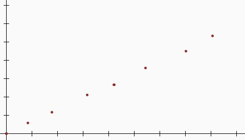

---
hide:
  - toc
---

# TD 4 : Machine learning : Introduction à l'optimisation

Dans ce deuxième TD nous introduirons les notions d'apprentissage automatique en utilisant les méthodes d'approximation.
Dans le TD précédent, nous avions utilisé l'algorithme de Euler afin d'approximer l'intégration des équations de mouvement d'un objet à partir de son accélération.

Ici nous proposons une approche différente. Imaginons une observation un système réel : la position d'un satellite ou d'un objet en mouvement.
Vous réalisez  des mesures au cours du temps pour avoir des données relative à son déplacement.

|   x   |   t   |
| ----- | ----- |
| 0.0   | 0.0   |
| 0.058 | 0.084 |
| 0.116 | 0.178 |
| 0.211 | 0.316 |
| 0.266 | 0.422 |
| 0.358 | 0.544 |
| 0.450 | 0.702 |
| 0.533 | 0.807 |

Vous remarquez que le comportement de cette objet est linéaire.

#### Question 1:

En utilisant la méthode des moindres carré, approximer la loi de comportement ($ax + b$) de l'objet en mouvement.

??? "Indice"
    $$
    \sigma_{x}^2 = \sqrt{\frac{\sum_{n=1}^{n}(x_i - \overline{x})}{n}}
    $$

    $$
    \sigma_{xy} = \sum_{n=1}^{n}\frac{(x_i - \overline{x})(y_i - \overline{y})}{n}
    $$

    Où $\sigma_{x}$ est l'écart type de x et où $\sigma_{xy}$ est la covariance de la série.
    L'équation de la droite peut être trouvée par $y = ax+b$ où   $a = \frac{\sigma_{xy}}{\sigma_{x}^2}$ et $b=\overline{y} - a\overline{x}$

#### Question 2:

Après un certain temps vous remarquez que vos mesures sont de plus en plus imprécises et que le comportement du système change au cours du temps (S'agirait-il d'un OVNI ??)

Vous décidez d'utiliser une méthode itérative pour prédire son comportement avec plus d'agilité.

Écrivez l'algoritme d'approximation en utilisant la méthode de la descente de gradient.

??? "Indice"
    Vous souhaitez approximer le coefficient directeur de la droite : $a$. La méthode de la descente de gradient permet de calculer la nouvelle valeur de $a$ en utilisant le gradient de la fonction :

    $$
      \nabla f(x) = \left[ \frac{\partial f(x)}{\partial x} \right]
    $$

    Ici nous souhaitons approximer une fonction affine. 
    Toutefois utiliserons la méthode de la descente de gradient pour minimiser l'erreur entre notre approximation et le système réel.
    Il faut donc calculer le gradient de la fonction erreur.

    $\epsilon(a, b) = y_i - a * x_i + b$

    \begin{align}
     \nabla \epsilon(a, b) &= \begin{bmatrix}
            \frac{\partial \epsilon(a, b)}{\partial a} \\
            \frac{\partial \epsilon(a, b)}{\partial b}
          \end{bmatrix}
    \end{align}

    \begin{align}
     \nabla \epsilon(a, b) &= \begin{bmatrix}
            x \\
            1
          \end{bmatrix}
    \end{align}

    Ici les deux inconnues de la fonction sont $a$ et $b$. Nous pouvons poser le vecteur C de la manière suivante : 

    \begin{align}
     C &= \begin{bmatrix}
            a \\
            b
          \end{bmatrix}
    \end{align}

    \begin{align}
          C_{n+1} = C_{n} + l.\nabla \epsilon(a,b)
    \end{align}

    Cela nous donne le schéma itératif suivant : 

    $$
    \begin{equation}
      \begin{cases}
        a_{n+1} = a_n + l.\epsilon*x\\
        b_{n+1} = b_n + l.\epsilon
      \end{cases}
    \end{equation}
    $$
    
    On remarque bien que a évolue en fonction de l'erreur proportionnellenment à x et que b n'évolue qu'en fonction de l'erreur.
    N'hésitez pas à tester ce code dans processing ou dans Mathlab pour essayer.

