# TP 1 : Prise en main NX et modelisation 3D

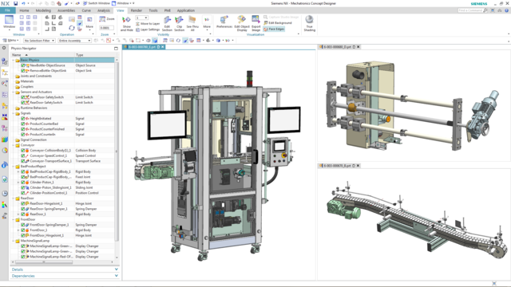

## Objectifs
A partir des plans de cotations de la maquette d'ascenseur, réaliser une maquette virtuelle 3D afin de préparer le jumeau numérique.

<!--Image assemblage final -->

- [x] Créer des modèles numériques sous Siemens NX
- [x] Importer un modèle 3D existant
- [x] Créer un assemblage 3D de composants
- [x] Créer une animation 3D

## Matériel et logiciel nécessaire

- PC équipé avec 
    - Siemens NX (+Mechatronics Concept Designer)

## Support pédagogique
L'ascenseur. Le prototype d'ascenseur possède une cabine pouvant se déplacer entre 4 étages. Chaque étage est équipé de 3 fourches optiques :

- Porte ouverte
- Porte fermée
- Présence cabine

Par sécurité, chaque fourche optique est doublée d'un capteur de contact TOR. (excepté les capteurs de présence cabine aux étages 1 et 2)

---

## Téléchargement 
- Fichier de départ : [base.prt](files/tp1/base.prt)
- Plans de cotations : [cotations.pdf](files/tp1/cotations.pdf)

[Télécharger le zip](files/tp1/tp1.zip){ .md-button .md-button--primary}

## Travail à réaliser :

- [ ] Lire et comprendre [les plans de cotation](files/tp1/cotations.pdf) 
- [ ] Importer le modèle existant
- [ ] Créer un assemblage de composants
- [ ] Créer l'animation d'un scénario de fonctionnement.

### 1. Création d'un nouveau projet

Pour commencer, créez un nouveau dossier sur la session. Renommez le dossier `tp1_ascenseur_nom_promo` (ex : `tp1_ascenseur_JulesTOPART_I5GSPA`) puis, lancer __Siemens Mecatronics concept designer__.

!!! Warning
    Si NX ne se lance pas et affiche un message d'erreur lié à un problème de licence, suivez ce [tutoriel](../documentation/software/nx/nx-licence.md)

Une fois que le logiciel NX est correctement démarré, cliquez sur l'icône __Nouveau__  en haut à gauche de l'interface.

Dans le menu de création de fichier, sélectionnez  __Assemblage__.

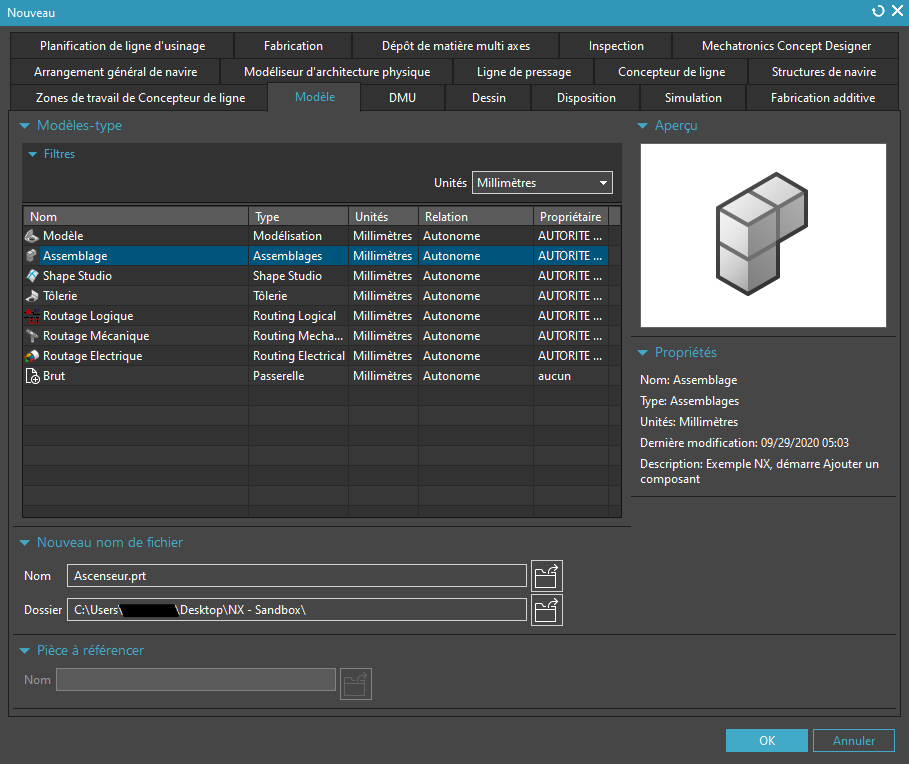

Renommez le fichier `Ascenseur.prt` puis enregistrez le dans votre dossier de travail.
Cliquez ensuite sur __OK__.

### 2. Importation d'un composant existant

Pour importez un composant, cliquez sur __Ajouter un composant__ dans l'onglet __Assemblage__

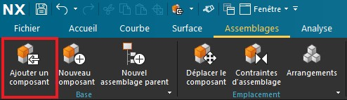

Selectionnez ensuite le fichier `base.prt` préalablement placé dans le dossier du projet.
Cette pièce est la partie immobile de l'ascenseur, nous allons donc l'immobiliser dans le menu d'importation.

Pour cela, dans la rubrique, __Placement__, selectionnez la case __Contraindre__ puis cliquez sur le symbole __Fixe__.
Cliquez ensuite sur l'objet 3D dans l'espace de travail pour spécifier l'objet à figer.

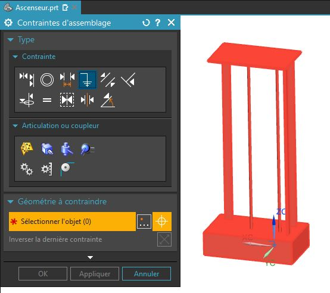

Cliquez ensuite sur __OK__ puis sur __Oui__ pour créer un encastrement.

Maintenant que la base est importée, nous pouvons modéliser les autres pièces du systèmes.
Nous devons obtenir l'arbe d'assemblage suivant à la fin de la conception : 

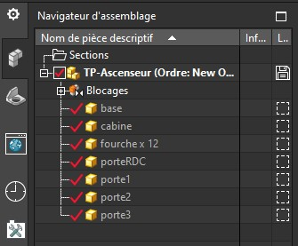

### 3. Nouvelle pièce

Nous allons commencer par modèliser une des douzes fourches optiques de l'ascenseur.
Commençons par créer une nouvelle pièce, comme pour l'étape 2, il faut se rendre dans l'onglet __Assemblage__ puis cliquez sur __Nouveau Composant__ 

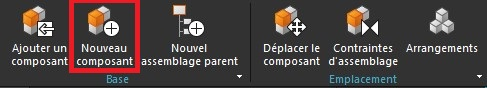

Cette fois nous allons créer un modèle, sélectionnez __Modèle__ et renommez le fichier `fourche.prt`.
Un fois encore pensez à spécifier le chemin du dossier projet.

Puisque l'objet n'est pas encore modèlisé, cliquez ensuite sur OK sans selectionner d'objet

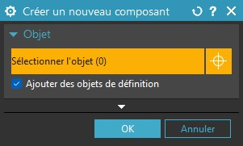

L'objet est maintenant créé, il apparait alors dans le volet de gauche, dans le navigateur d'assemblage. Faîte un clic droit sur `fourche` dans l'arbre et selectionnez __ouvrir dans la fenêtre__. Un nouvel onglet vierge devrait apparaitre.

### 4. Nouvelle esquisse

Pour modèliser la pièce, commencez par tracer une esquisse, pour cela, il faut se rendre dans l'onglet __Accueil__ et cliquer sur __Esquisse__

Selectionnez le plan vertical __XZ__ puis validez.

!!! info
    Lors de la création d'une esquisse, NX crée immédiatement un nouveau système de coordonnées ayant l'axe Z pour normal au plan de l'esquisse. Tous les tracés de l'esquisse appartiendront au plan XY du système de l'esquisse.

Nous pouvons maintenant dessiner le profil de la fourche optique. Référez vous au plan de cotation pour dessiner la fourche au bonne dimension.

En utilisant l'outil __Profil__, dessiner les contour de la fourche comme cela :

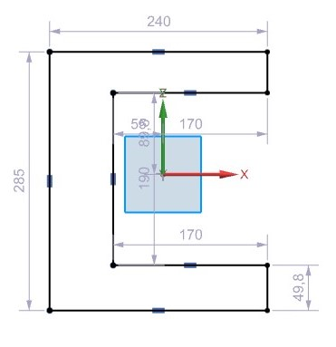

!!! info
    Utilisez ++esc++ pour quitter l'outil actif.

??? caution
    NX ajoute automatiquement des côtes à tout les objets d'une esquisse. Ces cotations sont flexible et aparaisse en gris clair. Vous pourrez donc déplacer les points et les segments à votre guise dans que le profile n'est pas contraint.
    Notons aussi que tous les objets sont positionnés par rapport à l'origine de l'esquisse. Il est parfois possible et/ou neccessaire de spécifier le point d'origine de  l'esquisse lors de sa création.

Pour créer des contraintes géométrique, il est possible de faire un __clic droit__ sur l'objet à contraindre puis de selectionner le type de contrainte approprié.
Pour créer la première cotation, faite un clic droit sur le segment en haut du profil puis cliquez sur l'icône de Cote horizontal.

??? info
    Lorsque NX crée une cote, il y assoscie automatiquement un paramètre. Un paramètre en CAO est une variable modifiable à tout instant permettant de modifier une pièce automatiquement à la fin de la conception. Dans l'idéal, toute modèlisation devrait être paramétrique pour accélérer le cycle de conception.

Une fois la cote créée, il est possible de double-cliquer dessus afin de l'éditer. Dans le menu d'édition de cote linéaire, renomez le paramètre (`p0`)en `width` puis entrez la valeur de la cote.

Pour contraindre le segment à gauche du profil, une contrainte d'égalité peut être préférable afin de limiter le nombre de paramètre. Dans la barre d'outil cliquez sur __Contraintes Géométriques__ 

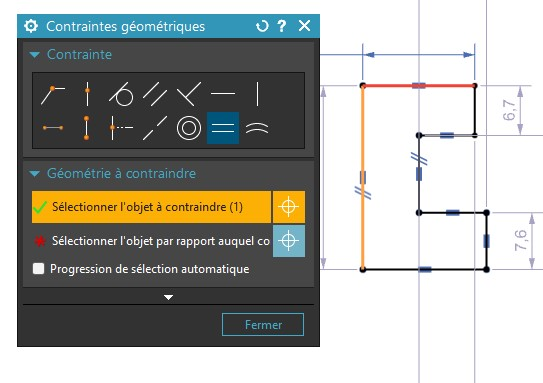

Utilisez à nouveau l'outil de __contrainte géométrique__ pour créer une liaison de __colinéarité__ entre les deux segments verticaux de droite.

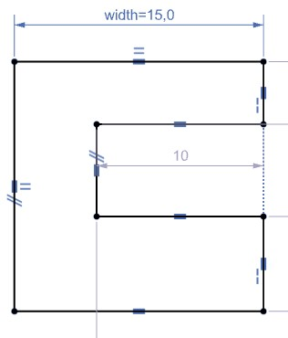

Pour éditer une cotation temporaire déjà existante vous pouvez simplement double-cliquer dessus pour la transformer en cote linéaire.
Vous pouvez également utiliser des formules à la place d'une valeur dans le menu de cote linéaire. La profondeur de la fourche (Manquante sur le plan) est égale à `width/2`.

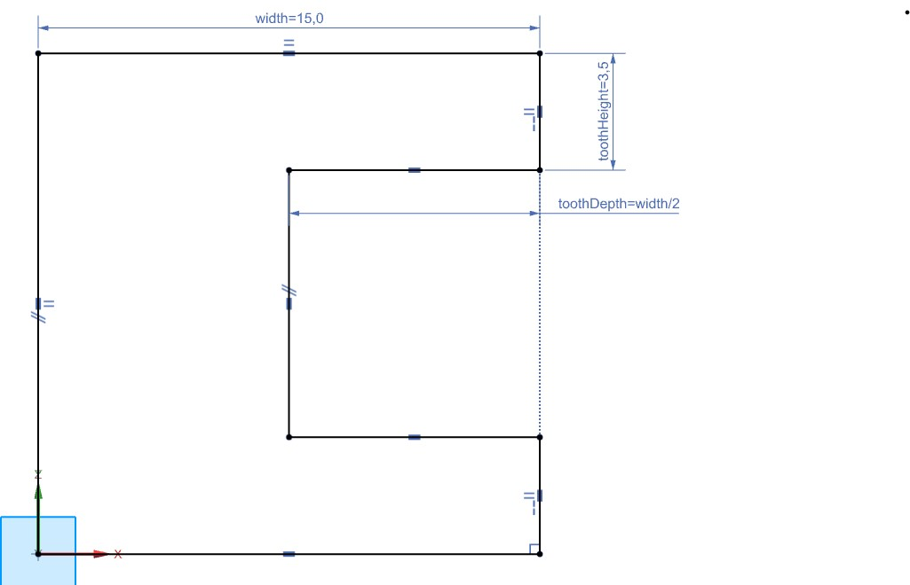

### 5. Extrusion

L'esquisse terminée, Il faut ensuite l'extruder. Pour cela, cliquez sur le button terminer l'esquisse (Drapeau noir et blanc).

Cliquez ensuite sur extrusion puis selectionnez le profil que de la fourche.

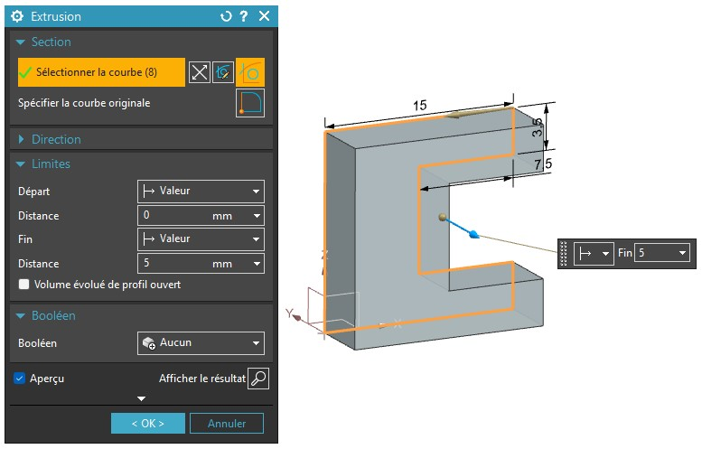

Une fois l'extrusion terminée, enregistrer la pièce dans votre dossier de travail.
Répétez désormais tout le processus afin de réaliser les autres pièces de l'ascenseur.

Pièces à réaliser : 

- [x] Fourche optique
- [ ] Cabine d'ascenseur
- [ ] Porte (Sans inscription)

Les trois portes étant similaire, créez une porte sans inscription pour le moment, nous dupliquerons la porte plus tard et ajouteront les inscriptions dans le même temps.

### 6. Assemblage

Une fois que toute les pièces sont réalisée, vous pourrez passer à l'assemblage de celles ci.
Commencez par disposer les portes en utilisant l'outil de positionnement. Nous n'utiliserons les contraintes d'assemblage seulement pour placer plus facilierment les composants. Les contraintes ne serviront pas dans l'animation de l'ascenseur.

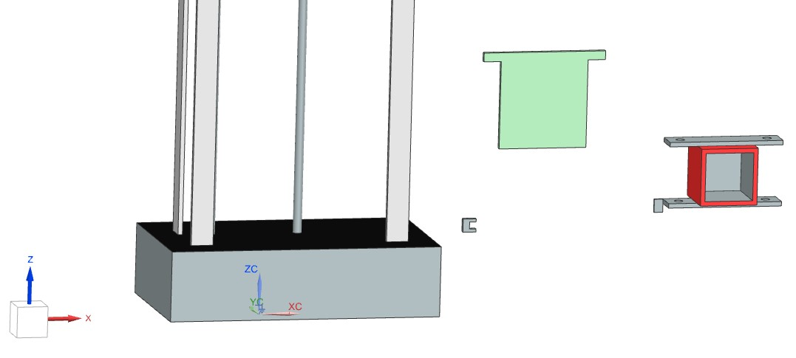

Commençons par placer la cabine de l'ascenseur.
Pour cela, créez une contrainte de glissement entre les trous cylindrique de la cabine et les rail cylindrique de la base.

Cliquez sur l'icône __Contrainte d'assemblage__ comme ci-dessous :

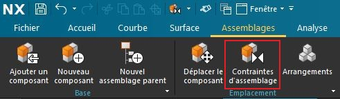

Puis créez une articulation pivot glissant entre l'axe et la cabine. Répetez avec le deuxième axe.

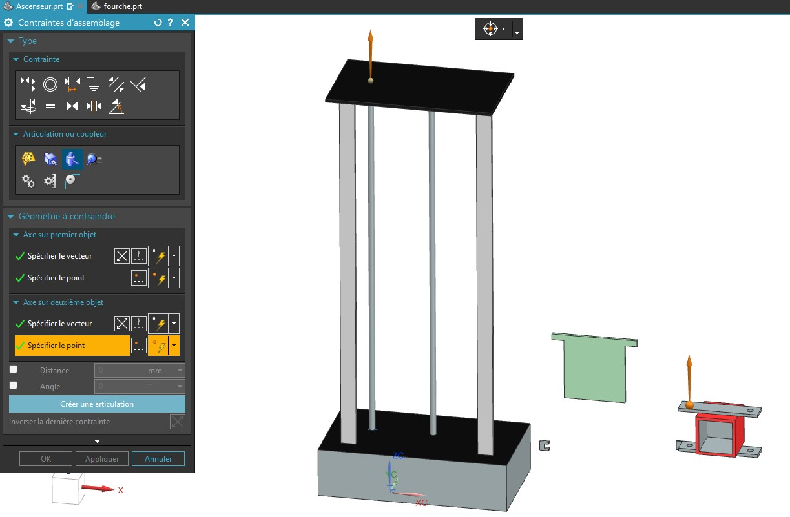

Déplacez ensuite la cabine vers le bas en utilisant l'outil __Déplacer le composant__. Lorsque vous êtes satisfait de la position de la cabine, servez vous de cette position pour placer les autres composant.

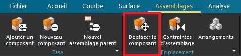

Placez ensuite la première porte devant la cabine à quelque millimètre derrière les rail plat verticaux.

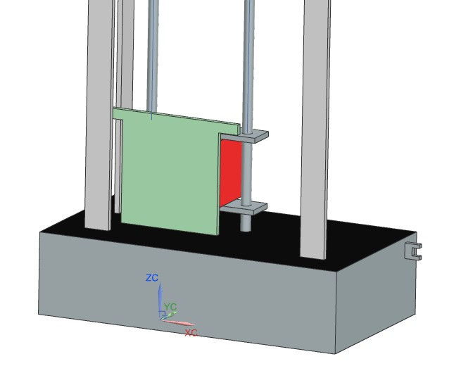

En se basant sur la position de la portes nous pouvons désormais placer les fourches optiques.
Placez la fourche de détection de la porte fermée comme suit.

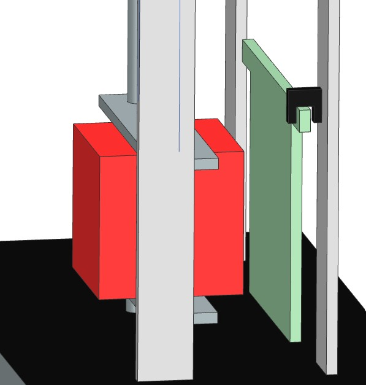

Nous allons maintenant dupliquer la fourche sur le rail côté porte ouverte. Pour cela cliquez sur __Ajouter un composant__, dans l'onglet __Assemblages__.

Selectionnez la fourche optique et accrochez la à la fourche déjà en place grâce à l'îcone en rouge ci dessous. 
Assurez vous que le placement est configuré sur __Déplacer__ (Zone verte).
Déplacez ensuite la fourche jusqu'à sa position sur l'autre rail.

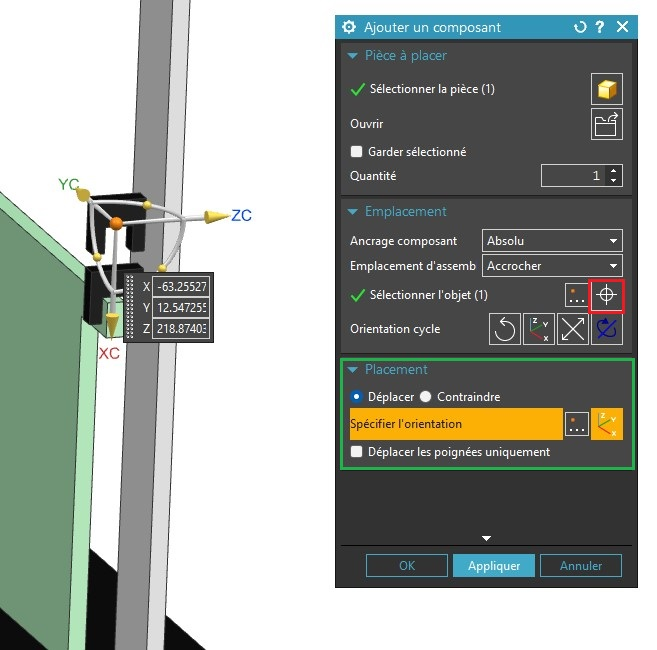

Déplacez ensuite la nouvelle fourche jusqu'a la position de porte ouverte.

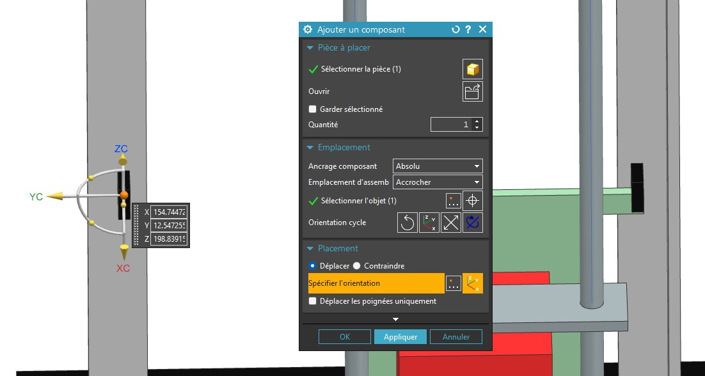

Répetez ce processus pour la dernière fourche. Un fois la dernières fourches placée, Utilisez l'outils __Duplication de composants__ pour copier la porte et les trois fourche 150mm plus haut. Nous répéterons cette duplication 4 fois pour obtenir les 4 étages.
Pensez à décocher le paramètre __Assosciatif__

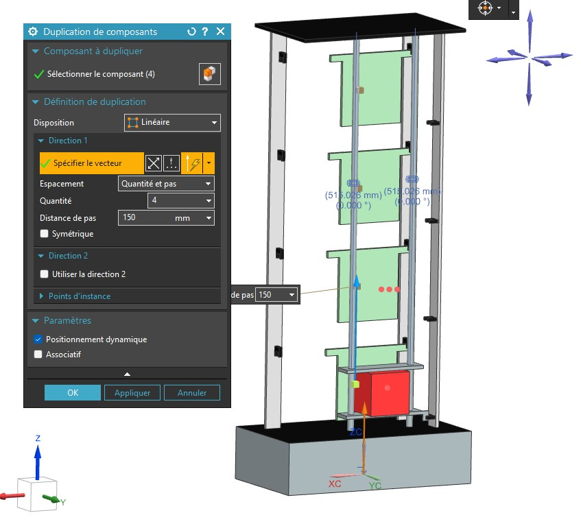

### 7. Animation

Une fois tout les composant en place Il est possible de créer une animation pour démontrer le fonctionnement de la maquette nuémrique.

Pour cela, rendez vous dans l'onglet __Application__ et choississez __Mechatronics concept designer__

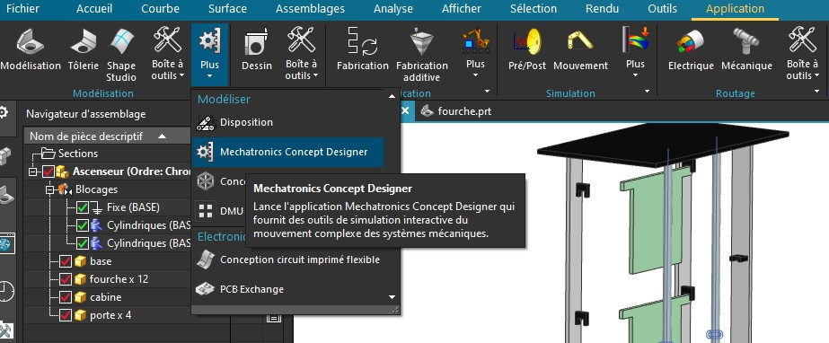

Rapprocher vous du professeur pour réaliser cette partie.

