# TP 2 : Simulation physique numérique

Réaliser un jumeau numérique d'un système de production industrielle permet de :

- Simuler des interventions (Rétrofit, Amélioration continue ... ) sans interrompre la production de la ligne physique
- Optimiser le cycle de production en simulant les différents mode de fonctionnenent
- Détecter des pannes et des divergence en amont de l'implantation
- Concevoir le produit et le système de production conjointement.

Dans ce TP nous allons nous interesser à la méthode à mettre en oeuvre pour réaliser un jumeau numérique basé sur les solutions Siemens.

## Objectifs
A partir de la liste des composant et du mode d'emploi, préparer la configuration de l'automate dans TIA Portal, afin de modifier le programme automate sans interompre l'ascenseur.

- [x] Savoir importer et configurer un projet TIA Portal
- [x] Savoir mettre en place un automate virtuel
- [x] Connaitre la démarche de réalisation d'un jumeau numérique 3D dans NX MCD
- [x] Piloter un jumeau numérique entièrement fonctionnel depuis un automate virtuel.

## Matériel et logiciel nécessaire

- PC équipé avec
	- TIA Portal
	- PLCSIM Advanced
	- Siemens NX (+MCD)

## Support pédagogique
L'ascenseur. Le prototype d'ascenseur possède une cabine pouvant se déplacer entre 4 étage. Chaque étage est équipé de 3 fourche optique :

- Analyse fonctionnelle
- Analyse organique
- Manuel utilisateur
- Maquette d'ascenseur
- Platine équipé d'automate Siemens S200

---

## Téléchargement

!!! example "Projet de Base"
	- Projet de base TIA : [TIA.zip](files/tp2/TIA.zip)
	- Projet de base NX  : [NX.zip](./files/tp2/NX.zip)

!!! info "Documents"
	- Documentation adressage : [adress.pdf](files/tp2/Documentation/adress.pdf)
	- Liste des équipements : [list-equipment.pdf](files/tp2/Documentation/list-equipment.pdf)
	- Listes des E/S : [list-io.pdf](files/tp2/Documentation/list-io.pdf)

??? bug
	- Erreur lancement TIA Portal : [error-start.pdf](files/tp2/Documentation/error-start.pdf)
	- Erreur pupitre opérateur : [error-panel.pdf](files/tp2/Documentation/error-panel.pdf)

[Télécharger le zip TIA](files/tp2/TIA.zip){ .md-button .md-button--primary}
[Télécharger le zip NX](files/tp2/NX.zip){ .md-button}

## Travail à réaliser :

- [ ] Configurer les compposant de la platine dans TIA portal
- [ ] Créer un automate virtuel dans PLCSIM Advanced
- [ ] Connecter l'automate virtuel à TIA Portal
- [ ] Connecterl'automate virtuel avec le jumeau virtuel sous NX
- [ ] Configurer la simulation physique sous NX
- [ ] Simuler le programme automate et modifier le programme automate sans interruption de fonctionnement

## Partie A - Siemens NX Mechatronics concept designer :

- [ ] Importer l'assemblage de l'ascenseur
- [ ] Créer les corps physique de la simulation
- [ ] Créer les articulations
- [ ] Créer les contrôle de vitesse
- [ ] Créer les capteur
- [ ] Créer les corps de collision
- [ ] Créer les signaux de la simulation
- [ ] Créer les expressions d'adaptation des signaux
- [ ] Connecter les signaux à l'automate

### 1. Importation de l'assemblage

Commençons par créer un nouveau projet. Pour cela, créez un nouveau dossier sur la session. Renommez le dossier `tp2_digitaltwin_nom_promo` (ex : `tp2_digitaltwin_JulesTOPART_I5GSPA`).
Dans ce dossier, téléchargez puis décompressez les fichiers [Assembly.zip](./files/tp2/NX.zip) puis, lancer __Siemens Mecatronics concept designer__.

!!! Warning
    Si NX ne se lance pas et affiche un message d'erreur lié à un problème de licence, suivez ce [tutoriel](../documentation/software/nx/nx-licence.md)

Une fois que le logiciel NX est correctement démarré, cliquez sur l'icône __Ouvrir__  en haut à gauche de l'interface.
Dans l'explorer selectionnez `Assembly.prt` dans votre répertoire projet.

### 2. Création des corps soumis à la physique
NX MCD permet de simuler fidèlement un système mécatronique en mouvement. Pour cela il faut toutefois paramétrer la simulation de manière à la rendre réaliste. NX est capable de simuler les comportements cinématique des objets en tenant compte de la force de gravite, des force de frottement... Toutefois la simulation suppose l'utilisation de matériaux indéformable et homogène.

Afin d'alléger la simulation, NX permet de ne soumettre que quelques corps à une lois physique. Par défaut aucun corps n'est selectionner. Il nous faut donc lui communiquer quel corps doit simuler la gravité et lesquel simule un capteur par exemple. C'est cela que nous allons configurer maintenant.

Pour commencer, rendez dans l'application __Mécatronic concept designer__ depuis l'onglet __Application__.

Un fois dans MCD, selectionnez l'outil __Corps rigide__ dans le groupe __Mécanique__.

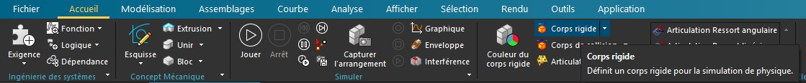

Nous allons maintenant créer un corps physique rigide (indéformable) soumis au loi de la physique dans notre simulation. Ici les objets soumis à la phisyque sont :

- La cabine d'ascenseur
- Les portes de chaque étages

Aucune autres pièces ne doit se déplacer. Nous aurons donc 5 _Corps rigide_ dans l'arbre du __navigateur physique__.
Selectionner la cabine d'ascenseur dans sont intégralité (En utilisant l'arbre du [navigateur d'assemblage](../tp1/#2-importation-dun-composant-existant))

Pour cette exemple nous laisserons les paramètre de masse et d'inertie à leur valeurs automatiques. 

!!! info
	Il est possible d'afiner les paramètres de simulation en donnant précisément la masse des éléments ou encore en précisant leur moment d'inertie. On peut alors simuler le comportement cinématique d'objet dont la répartition du poinds n'est pas homogène. La plupart des logiciel de CAO moderne permettent d'obtenir ces données pour peu que la maquette numérique soit suffisamment détaillée. Notons aussi qu'il est possible d'attribuer des étiquettes à des objets afin de simuler les intéractions entre plusieurs objets de manière optimisée. Par exemple si je créer des objets ayant une étiquette A, il n'interagirons pas avec les objets ayant l'étiquette B. Cela permet de fluidifier la simulation en évitant de couteux calcul au CPU.

Renommez le corps rigide en `RB-Cabine` (__RB__ pour __Rigid body__) puis valider avec __Appliquer__.

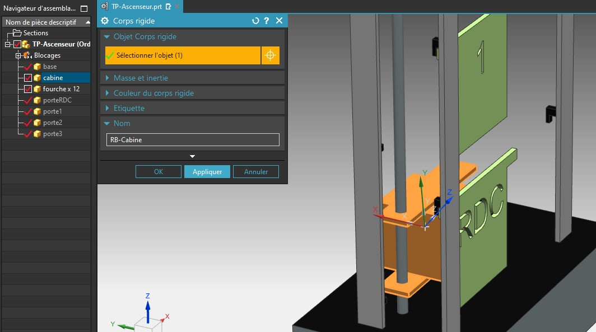

Répéter cette opération afin de créer les corps rigide suivants : 

- RB-Porte0
- RB-Porte1
- RB-Porte2
- RB-Porte3

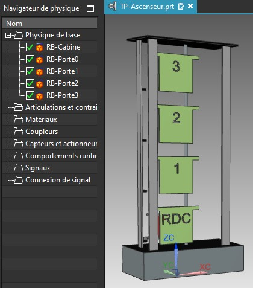

Désormais, tout ces RigidBody obéissent à la gravité. Utiliser le bouton __Jouer__ pour lancer la simulation.

<iframe width="889" height="530" src="https://www.youtube.com/embed/AjnXio9cbh8" title="YouTube video player" frameborder="0" allow="accelerometer; autoplay; clipboard-write; encrypted-media; gyroscope; picture-in-picture" allowfullscreen></iframe>

!!! info 
	Vous pouvez essayer d'intéragir avec les objets de la simulation en utilisant la souris (drag & drop). Il est également possible de créer des boutons (ARU) ainsi que des voyants dans la simulation.

### 2. Création des articulations

Afin de contraindre les corps rigides crées précédemment, nous allons maintenant créer les articulations. 
Pour commencer, créons une articulation glissière entre la cabine et la le repère principal.

Cliquez d'abord sur __articulation de glissement__ dans la rubrique __Mécanique__

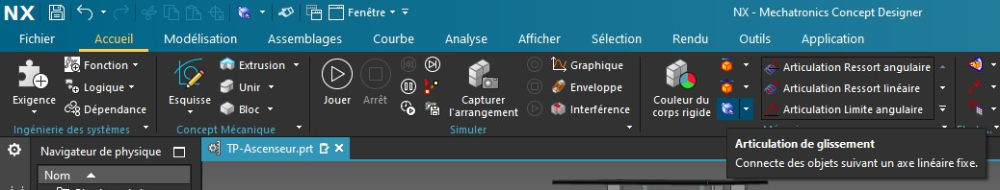

Selectionnez ensuite la cabine comme objet à contraindre, mais laissez la base vide. De cette façon, NX contraindra la cabine par rapport au repère global (Sans quoi nous aurions du créer une corps rigique fixe ayant pour composant le chassis de l'ascenseur).

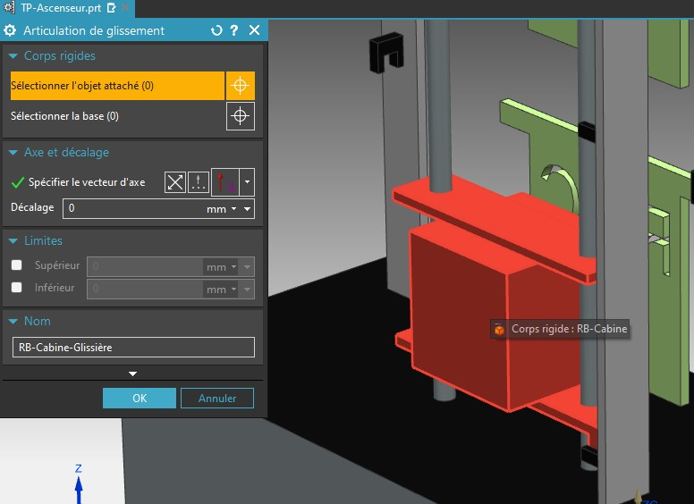

Et enfin, spécifer le vecteur. Selectionner un verteur vertical. Notons l'on donnera plus tard une vitesse de déplacement à la cabine. Une vitesse positive fera monter l'ascenseur et une valeur négative contrôlera la descente. Si le vecteur est dirigé vers le bas cela inversera cette configuration.

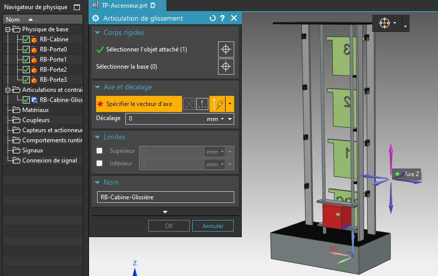

Renommez la liason en `JT-Cabine-slider` puis Valider avec OK.

Si vous essayer maintenant de lancer la simulation, vous ne remarquerez aucun changement flagrant. Pourtant nous avons contraint la cabine à un déplacement selon un seul axe. Elle ne peut pas tourner sur elle même par exemple contrairement au porte.

<iframe width="889" height="530" src="https://www.youtube.com/embed/XMkd3OgYclw" title="YouTube video player" frameborder="0" allow="accelerometer; autoplay; clipboard-write; encrypted-media; gyroscope; picture-in-picture" allowfullscreen></iframe>

Recommencez maintenant ce processus afin de contraindre les 4 portes en utilisant une __contrainte de glissement__ vers __X positif__.

Renommez les liasons afin d'obtenir l'abre suivant dans le navigateur physique (__JT__ pour __Joint__): 

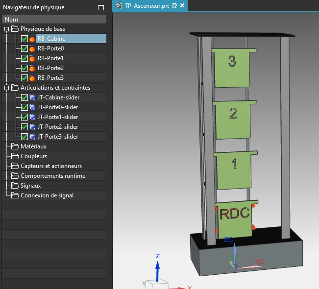

Si vous tentez maintenant de lancer la simulation, vous remarquerez que seul la cabine continue de tomber. En effet, elle est soumise à une force vertical (la gravité) qui est orienté dans le même sens que son axe de glissement. Par conséquent, elle tombe avec une accélération de :

_a = cos(0).g = g_

### 3. Création des contrôles de vitesse

Nous allons mainteant contraindre nos RigidBody en termes de vitesse pour pouvoir les contrôler grâce à l'automate.
Commencons par ouvrir le menu de __Contrôle de vitesse__ situté dans le groupe __Electrique__ de l'onglet __Acceuil__.

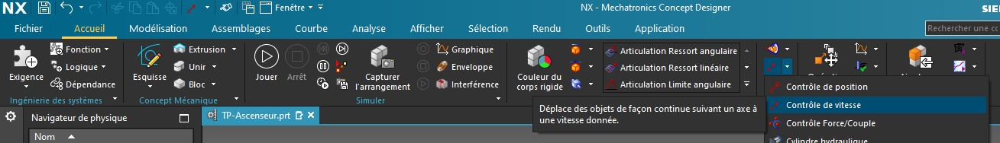

Selectionner ensuite l'une des articulation glissière créée précédemment, puis renommer le contrôle en `CT-Porte0-slider-speed`.

Répétez pour chaque liason afin d'obtenir l'arbre suivant : 

Si vous lancez la simulation maintenant, aucune des pièces ne devrait se déplacer car nous leur avont imposer une vitesse de déplacement constante de 0mm/s.
Essayer de modifier la vitesse d'une des corps en éditant le contrôle nouvellement créé.

### 4. Création des capteurs et des corps de collision.

NX offre la possibilité de simuler une large gamme de capteurs, des capteurs de contacts ou de distance jusqu'à tout d'encodeurs.

Notre ascenseur est doté de fourche optique TOR (Tout ou rien) que nous simulerons par des capteurs de distance très courte portée.
Sous NX les capteurs de distance sont capable de calculer la distance qui les sépare d'un objet. Il est aussi possible de lui faire retourner un booléen lorsqu'un objet entre dans son champ. Ici encore et par soucis d'optimisation il nous faudra préciser quels objet sont compris dans les calculs de collision. Il nous faudra donc créer des corps de collision.

Les fourches optiques de notre système sont utile pour détecter l'état des portes (ouvertes ou fermées) ainsi que la position de l'ascenseur (étage). Il nous faut donc définir les portes et la cabine comme corps de collisions pour qu'il soit détectable par nos capteurs. Toutefois nous ne selectionneront que les surfaces utile à la detection.

Commençons par ouvrir l'outils de création de __Corps de collisions__ située dans la rubrique __Mécanique__.

Selectionner ensuite la petite surface détectable par la fourche de présence cabine situé en bas à gauche de la cabine.

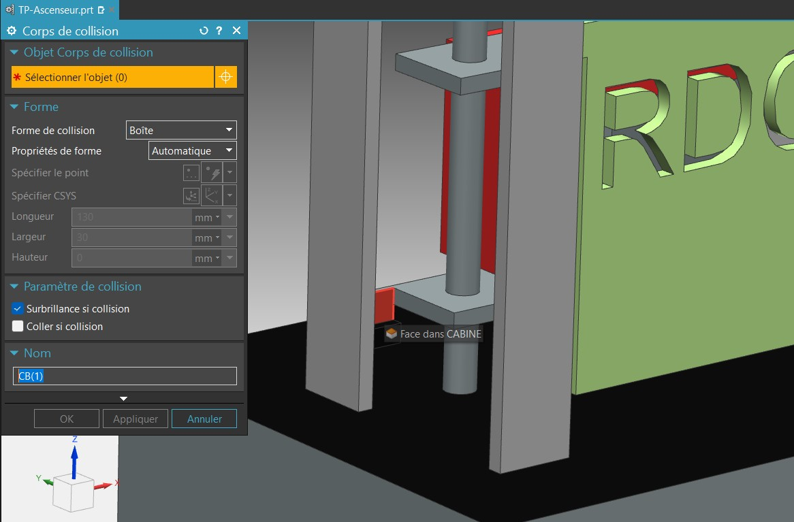

Puis renommer le corps de collission : `CB-Cabine`. Enfin, validez en laissant les paramètre par défaut :

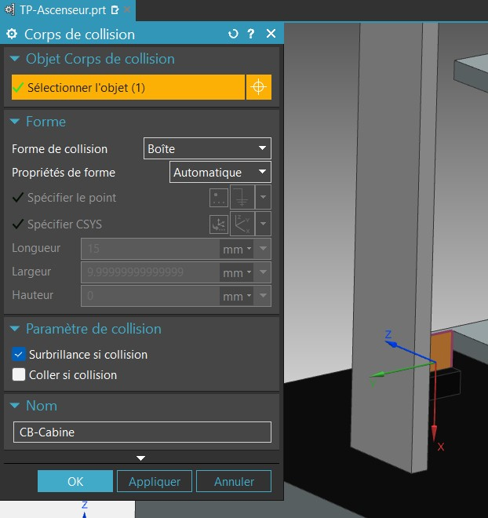

Répeter cette opération pour les 4 portes (en selectionnant la face avant de chaque porte) afin d'oobtenir l'arbre suivant :

Nous pouvons désormais ajouter les capteurs. Pour créer un capteur mobile il est possible d'attacher le capteur à un corps rigide pour les synchroniser. Comme ici nos capteurs sont fixe, pas besoin de selectionner de corps rigide.

Ouvrez le menu de création de __capteurs de distance__ située dans la rubrique __Électrique__.

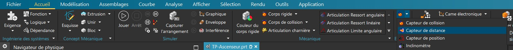

A l'aide de l'outil __Point sur Face__, selectionnez la face vertical opposée à la surface à détecter. Essayer de placer le point au centre de la face.

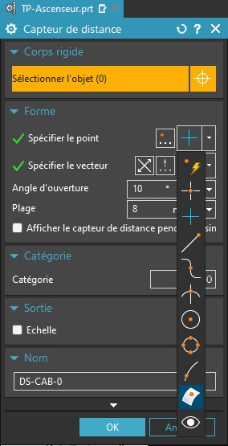

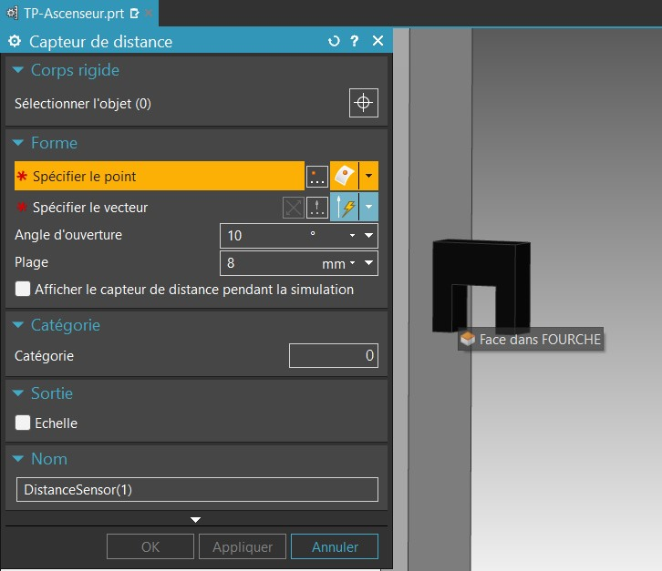

En guise de paramètre, nous réduirons le champ d'action des capteur à 8mm et à 10° d'angle. Selectionner ensuite le vecteur normal à la face du capteur pour obtenir un aperçu comme ci-dessous :

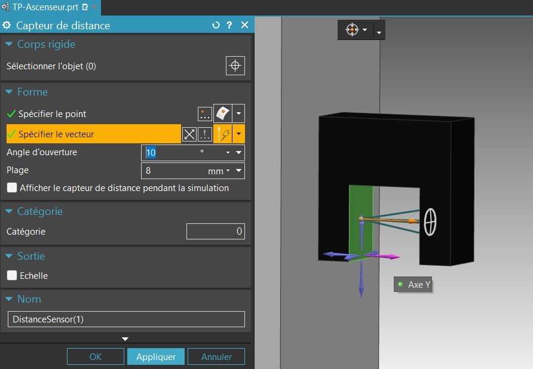

Répéter avec tout les autres capteurs pour obtenir l'arbre suivant : 

### 5. Création des signaux d'entrées

Maintenant que les capteurs et les actionneurs sont configuré, nous pouvons définir les signaux qui contrôleront la simulation. Comme dans un API, la simulation possède des signaux d'entrée et de sortie. Ici les sortie seront les capteurs puisque cette information doit remonter à l'automate. Les entrées seront les ordres de contrôles des actionneurs.

Pour simplifier la simulation nous n'utiliserons que des signaux booléen. Toutefois nous devrons convertir certain de ces signaux en vitesse pour contrôler les actionneurs.

Commençons par créer les signaux d'entrée permettant de faire monter et descendre la cabine. Ouvrez le menu de création de __signaux__ situé dans la rubrique __Électrique__.

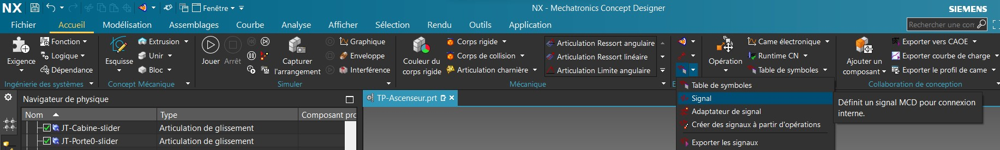

Créer ensuite un signal booléen d'entrée appelé : `MOT_CAB_UP` puis validez.

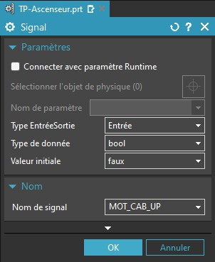

Les signaux doivent appartenir à des tables de signaux. Ici nous n'utiliserons qu'une seule table des signaux. Créer donc une nouvelle table en cliquant sur l'icône en bas à gauche de la fenêtre d'__ajout de signal__, puis renommer la table `Signaux internes`

Répeter l'opération (sans recréer de nouvelle table) afin de créer le signal `MOT-CAB-DOWN`.

Puis Créer les signaux booléen d'entrée de commandes des portes pour obtenir l'arbre suivant : 

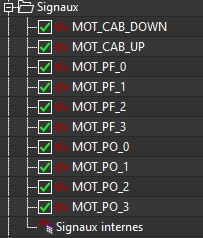

### 6. Création des signaux de sorties

Nous allons maintenant configurer les signaux de sortie. Pour cela il faut répétez le processus précédent en attachant un paramètre physique existant, ici l'état des capteurs de distance.

Cochez la case __Connecter avec un paramètre Runtime__ puis selectionner le paramètre __déclenché__ pour que la sortie soit configuré sur un paramètre booléen (TOR).

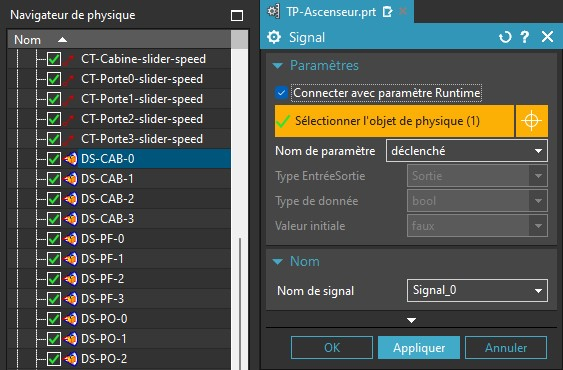

Renommez le signal `CPT_CAB_0` puis validez avec __OK__.

Répétez jusqu'a obtenir l'arbre suivant :

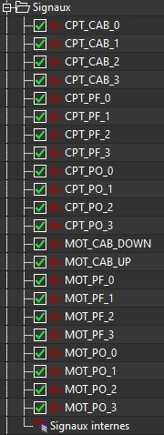

### 7. Déplacement de l'Ascenseur

Nous avons terminer la création des signaux d'entrée et de sorties, nous devrons ensuite les connecter avec les variables automates.
Toutefois, bien que nous ayons créé les signaux __MOT_CAB_UP__ et __MOT_CAB_DOWN__, les contrôleurs de vitesse ne peuvent être contrôlé avec des booléen. Nous devons par conséquent convertir ces signaux booléen en une vitesse en mm/s.

Pour cela vous aller créer un bloc d'expression dans les __Comportements Runtime__. C'est à dire que nous allons modifier le comportement des objets physique que nous simulons.

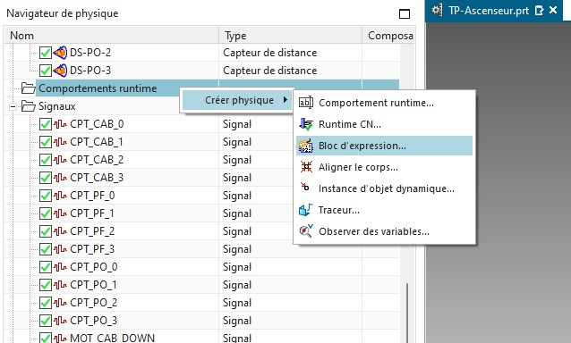

Un bloc d'expression permet d'écrire une nouvelle loi de simulation. Cette loi possèdera des entrées, et des sorties.
Ici les entrées seront nos paramètre booléen, et notre sorties sera une commande de vitesse en mm/s.
Commencez par renommer le bloc d'expression en `BE-Cabine` (__BE__ pour __Behavior__).

Créez ensuite 2 entrées à l'aide du bouton de droite : 

- __IN_CAB_UP__
- __IN_CAB_DOWN__

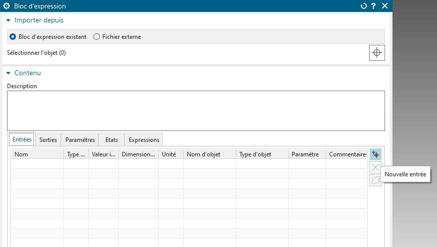

Ascossié ensuite les Entrée avec leurs signaux respectifs : 

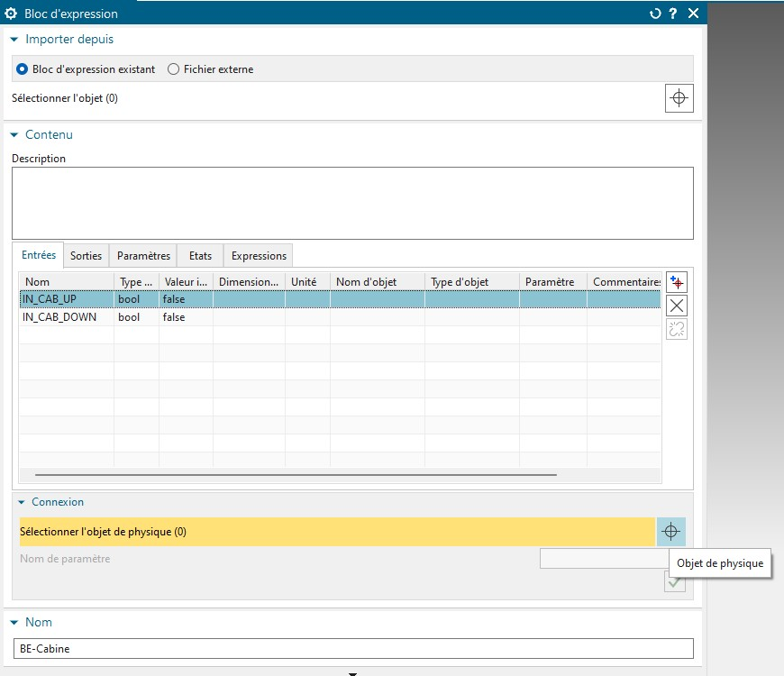

Créer ensuite une sortie appelée `OUT_CAB_SPEED`. Cette sortie sera une __Vitesse__ en __mm/s__

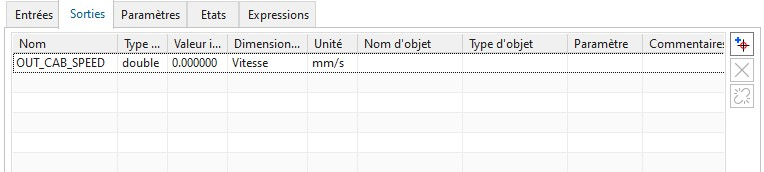

Liez ensuite la sortie a __CT-Cabine-slider-speed__.
Dans le dernière onglets du Bloc d'expression, selectionner __OUT_CAB_SPEED__ puis entrez une formule afin de donner à l'ascenseur une __vitesse positive__ pour le faire __monter__ ou __négative__ pour le faire __descendre__.

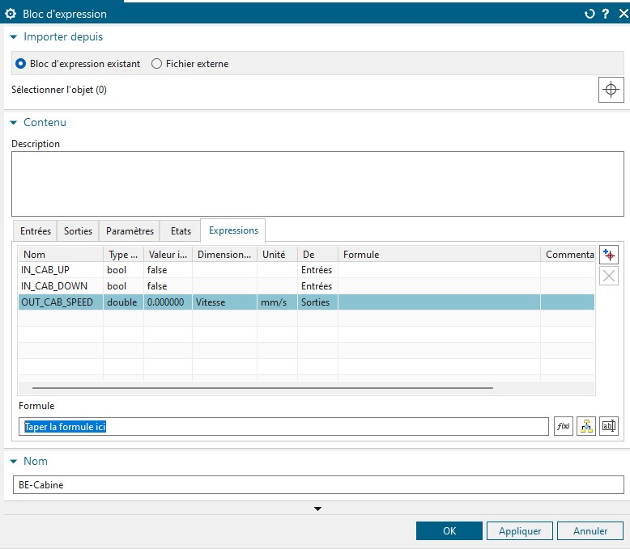

Répétez le même processus pour créer un bloc d'expression qui contrôlera les portes...

## Partie B - TIA portal & PLCSIM Advanced :

Le programme  automate est déjà pré-écrit dans le fichier `TIA.zip`. Cependant ce programme comporte des erreurs que vous devez corriger en vous appuyant sur le jumeau numérique.
Voici le Grafcet théorique du fonctionnement de l'automate : 

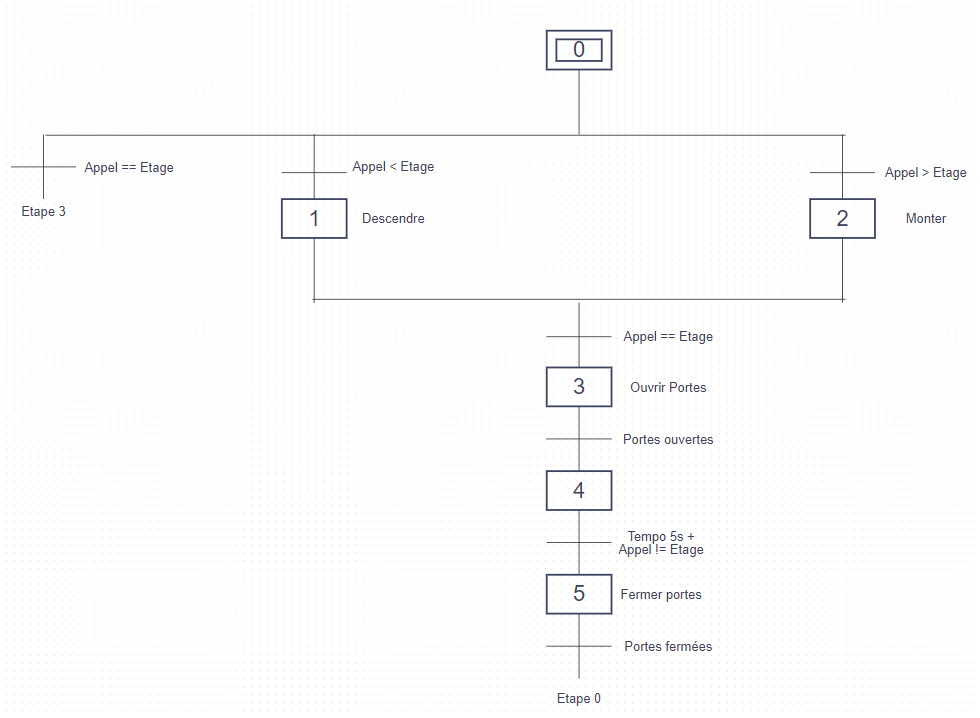

Maintenant que tout les signaux sonts créé, nous allons configurer l'automate virtuel le connecter à la simulation.

- [x] Créer un nouveau projet
- [x] Ajouter les composants
	 - [x] Ajouter le CPU (ET 200SP CPU - CPU 1512SP F-1 PN - 6ES7 512-1SK01-0AB0)
	 - [x] Ajouter les 4 Entrées DI 8x24VDC HF 6ES7131-6BF00-0CA0
	 - [x] Ajouter les 4 Sorties DQ 8x24VDC HF 6ES7132-6BF00-0CA0
- [ ] Connecter le PC et l'API Virtuel
	 - [ ] Démarer l'automate virtuel dans PLCSIM Advanced
	 - [ ] Cliquer sur le switch réseau de l'API
	 - [ ] Dans les propriétés, cliquer sur adresses Ethernet
	 - [ ] Ajouter un sous réseau
	 - [x] Définir l'IP de l'automate virtuel dans le projet
- [ ] Simuler l'interface graphique sous TIA
	- [x] Configurer l'IP de l'interface virtuel
	- [x] Connecter l'interface virtuel à l'automate virtuel
- [ ] Mettre à jour le programme pour faire fonctionner le dernière étage.

### Ouvrir le projet

Dans le dossier TIA de votre dossier de travail ouvrez le fichier `Ascenseur_UniLaSalle_VB6.ap16` avec __TIA Portal__.
Lancer ensuite le logiciel __PLCSIM Adv V3.0__

Aller dans la vue du projet puis rendez vous dans la configuration de l'automate (PLC_1). Double-cliquez sur __Configuration des appareils__.

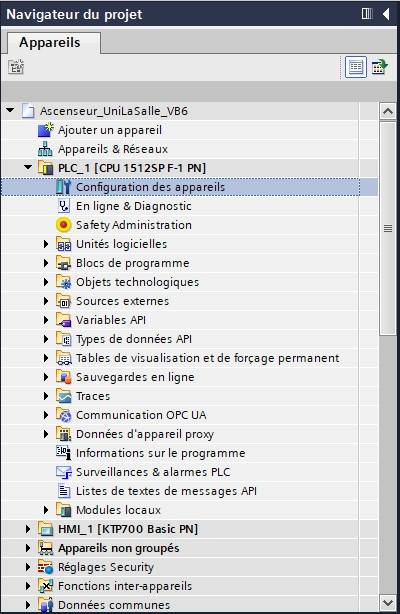

Ouvrez ensuite __PLCSIM Advanced v3.0__ et créez un nouvel automate virtuel __ET 200SP__, nommez le __API-TP__.
Cliquer sur __Start__ pour démarer l'automate virtuel.

Dans __TIA Portal__ double-cliquez  sur l'automate.

Dans les propriétés de l'automate rendez vous dans la rubrique __Interface PROFINET__, et renseignez l'IP de l'automate virtuel (Par défaut : `192.168.0.1`).

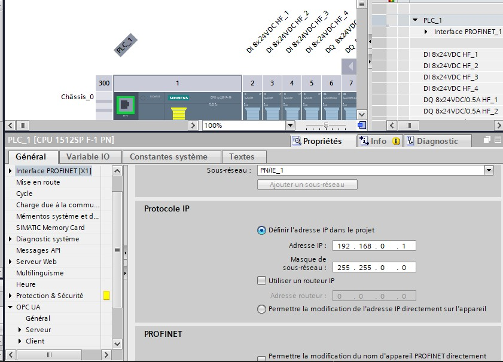

Dans l'arbre de gauche, selectionner __PLC_1 [CPU 1512...]__ puis cliquer sur Charger dans l'automate dans la __barre d'outils__. 

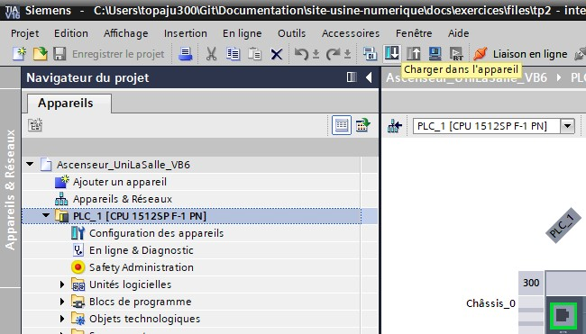

Valider en cliquant sur charger pour envoyer le programme et la configuration dans l'automate virtuel.

Dans __PLCSIM Advanced__, Selectionner l'automate puis passer le en mode __RUN__.

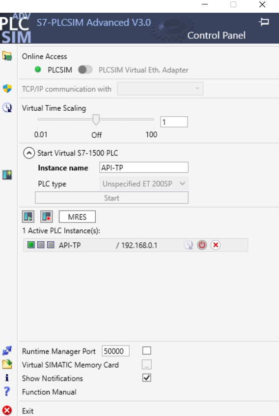

### Interconnexion WINCC - TIA - PLSIM - NX

Pour terminer, retourner dans __Siemens Mecatronics concept designer__. Dans la rubrique automatisation, ouvrez __Configuration de signal externe__.

Dans l'onglet PLCSIM, selectionnez l'automate API-TP puis cliquer sur __Mettre à jour les Balises__. Enfin, selectionnez toutes les balises.

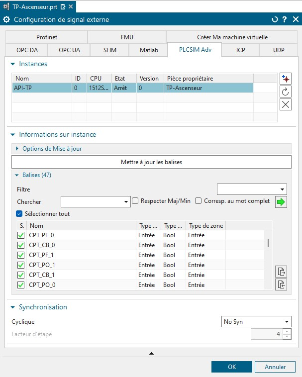

Nous allons maintenant faire correspondre les signaux de la simulation avec les variable API. Pour cela rendez vous dans la rubrique __Automatisation__ et ouvrez l'outil __Corresp. de signaux__.

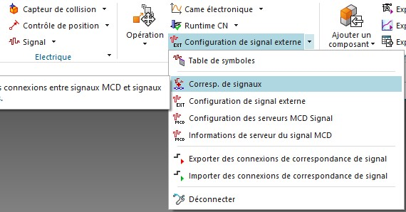

Cliquer ensuite sur __Executer correspondance auto__ ou assoscier les signaux mannuellement. 

!!! info
	Notons qu'il est important que les variable API et les signaux aient le même nom pour faciliter le processus.

Validez avec __OK__.
