# TP 4 : Jumeau numérique (TP évalué)

Dans ce dernier TP, votre mission sera d'évaluer l'intégration de nouvelles portes d'ascenseur. Pour cela, vous proposerez un jumeau numérique intégrant les nouvelles modifications et permettant de montrer que ces nouvelles portes ne perturbe pas les anciennes installations tout en sécurisant davantage l'ascenseur.

## Objectifs

- [x] Importer le modèle existant
- [x] Modeliser une pièce 3D dans un assemblage existant
- [x] Créer un assemblage de composants
- [x] Créer l'animation d'un scénario de fonctionnement.
- [x] Créer les capteurs et les actionneurs d'un jumeau virtuel
- [x] Connecter le jumeau numérique avec un automate virtuel.
- [x] Piloter un jumeau numérique entièrement fonctionnel depuis un automate virtuel.

## Matériel et logiciel nécessaire

- PC équipé avec
	- TIA Portal
	- PLCSIM Advanced
	- Siemens NX (+MCD)

## Support pédagogique

!!! example "Projet de Base"
	- Projet de base TIA : [TIA.zip](files/tp4/TIA.zip)
	- Projet de base NX  : [NX.zip](./files/tp4/NX.zip)

!!! info "Documents"
	- Documentation adressage : [adress.pdf](files/tp2/Documentation/adress.pdf)
	- Liste des équipements : [list-equipment.pdf](files/tp2/Documentation/list-equipment.pdf)
	- Listes des E/S : [list-io.pdf](files/tp2/Documentation/list-io.pdf)

??? bug
	- Erreur lancement TIA Portal : [error-start.pdf](files/tp2/Documentation/error-start.pdf)
	- Erreur pupitre opérateur : [error-panel.pdf](files/tp2/Documentation/error-panel.pdf)

[Télécharger le zip TIA](files/tp4/TIA.zip){ .md-button .md-button--primary}
[Télécharger le zip NX](files/tp4/NX.zip){ .md-button}

---

## Travail à réaliser :

- [ ] Importer l'assemblage.
- [ ] Modeliser les nouvelles portes.
- [ ] Positionner les nouvelles porte dans l'assemblage.
- [ ] Créer les capteurs
- [ ] Lier mécaniquement les portes à la cabine d'ascenseur.
- [ ] Créer un ressort de rappel des portes
- [ ] Créer les signaux de contrôle de la simulation
- [ ] Connecter l'automate avec le jumeau numérique.

### 1. Création du projet

Commençons par créer un nouveau projet. Pour cela, créez un nouveau dossier sur la session. 
Renommez le dossier `tp4_exam_noms_promo` (ex : `tp4_exam_JulesTOPART_ThomasFIOLET_I5GSPA`).

Dans ce dossier, téléchargez puis décompressez les fichiers [NX.zip](./files/tp4/NX.zip) et [TIA.zip](./files/tp4/TIA.zip) puis, lancer __Siemens Mecatronics concept designer__.

!!! Warning
    Si NX ne se lance pas et affiche un message d'erreur lié à un problème de licence, suivez ce [tutoriel](../documentation/software/nx/nx-licence.md)

Une fois que le logiciel NX est correctement démarré, cliquez sur l'icône __Ouvrir__  en haut à gauche de l'interface.
Dans le dossier NX, selectionnez `Assembly.prt`.

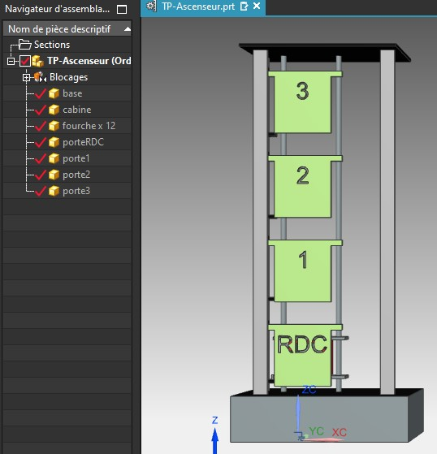

### 2. Modélisation des nouvelles portes

Vous allez maintenant modéliser les nouvelles portes de l'ascenseur.
Créer un nouveau composant dans l'assemblage puis nommez le `PorteDroite.prt`

Ouvrez ensuite ce composant dans une nouvelle fenêtre puis dessinez la pièce suivante : 

[Voir les cotations](./files/tp4/cotations.pdf){.md-button .md-button--primary}

Répetez ensuite le processus pour créer une pièce parfaitement symètrique à celle-ci, appelée `PorteGauche.prt`

### 3. Assemblage des portes

Après avoir modélisé les deux portes, posisionnez les de façon à les aligner avec la cabine.
Vous pouvez déplacer les deux portes en même temps pour gagner du temps.

Créez ensuite 2 nouvelle fourches  (TP 2) et positionnez l'ensemble comme cela : 

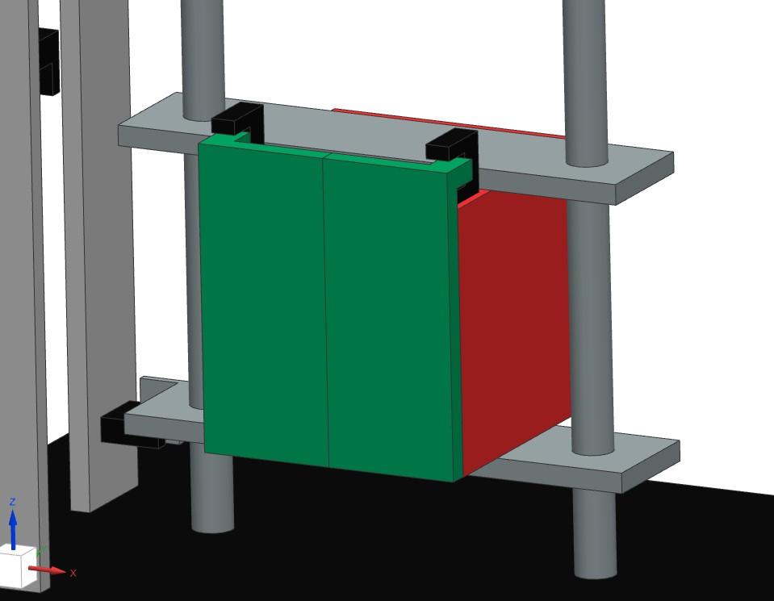

??? info
	Juste pour information, si les portes étaient ouvertes nous obtiendrions ce résultat :

	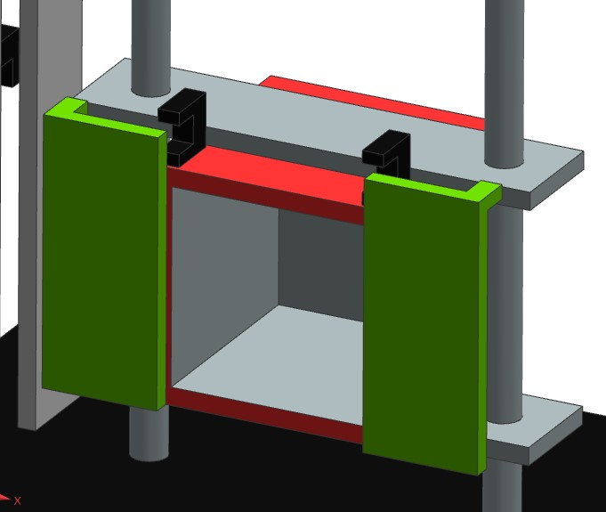

### 4. Création des capteurs

Comme dans le TP 2, nous allons créer 2 capteurs de distance. Cependant il s'agit, cette fois, de capteurs mobiles, nous devons donc simuler leurs déplacement.
Commencez par __créer un corps rigide__ pour chaques fourche de détection des portes de la cabine.

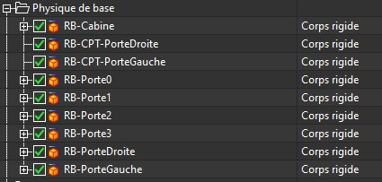

Fixer ensuite les fourches à la cabine en utilisant une articulation fixe (__Onglet mécanique__)

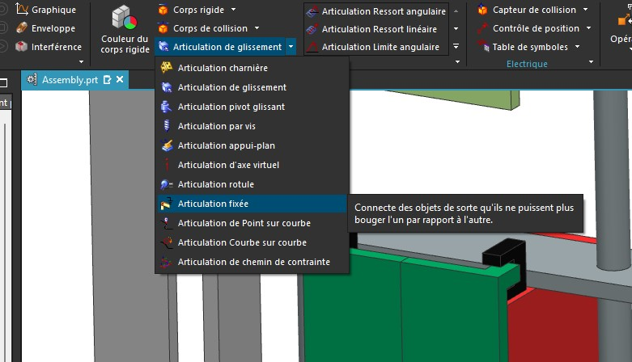

Dans le menu de fixation, selectionner la fourche optique puis la cabine. Renommer la liason puis validez.

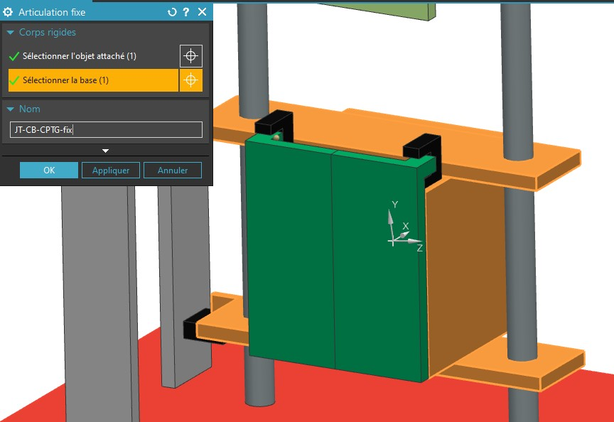

Répétez le processus pour le deuxième capteur puis __créer 2 capteurs de distance__ (TP2) en selectionnant la fourche comme corps rigide de référence.

### 5. Simulation des portes

Nous allons maintenant animer les portes comme dans le TP2. Selectionner les portes dans l'arbre d'assemblage puis créer un corps rigide pour chacunes d'elles.
Créer ensuite une corps de collision sur la face supérieur des deux portes.

Vous obtiendrez alors cela : 

Créez ensuite une articulation glissière horizontal pour chaque porte. (Utilisez le vecteur dans le sens de leur ouverture).

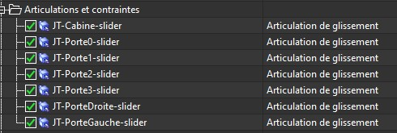

Une fois les glissières crées, nous allons créer un ressort ammortisseur pour créer un système monostable. Ainsi nous ne commanderons que l'ouverture des portes. La fermeture sera automatique.

Ouvrez le menu du création de ressort situé dans l'onglet Mécanique :

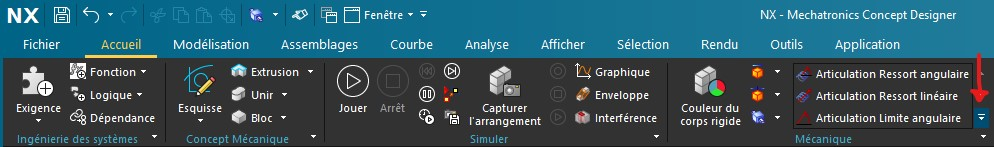

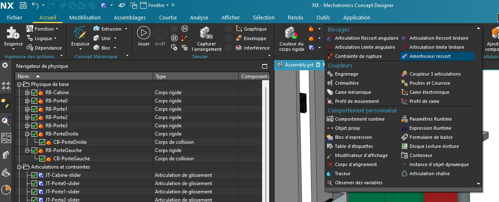

Entrez ensuite les paramètre suivant et selectionner la glissière de la porte droite.

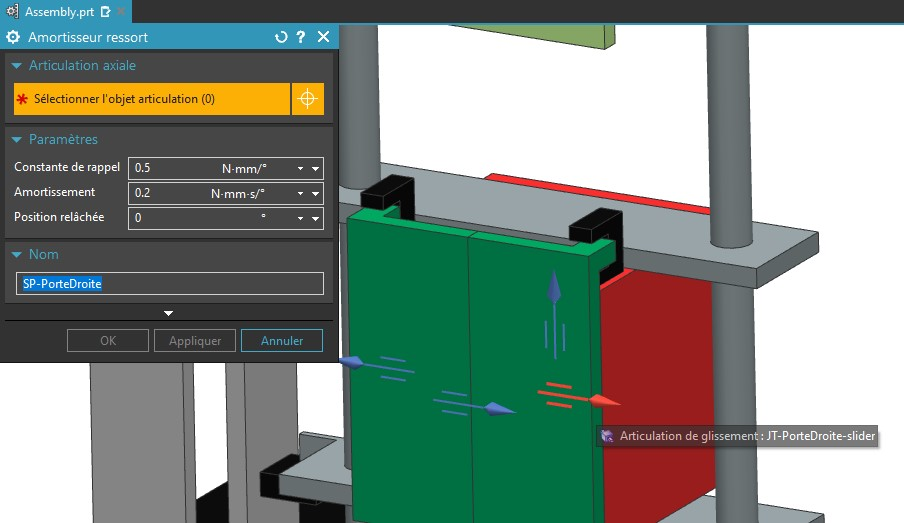

Répétez avec l'autre porte.

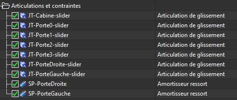

Maintenant que nous avons créer le rappel des portes de l'ascenseur, nous pouvons créer le __contrôle de force__ qui permettra d'ouvrir les portes.

Dans l'onglet electrique, ouvrez le menu de création de __Contrôle de Force/Couple__

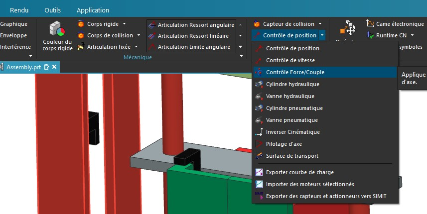

Créez ensuite une force de __7 Newton__ sur la glissiète de la porte droite.

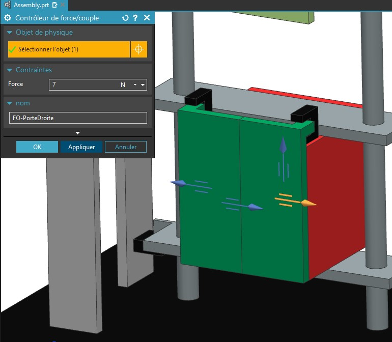

Répétez avec l'autre porte...

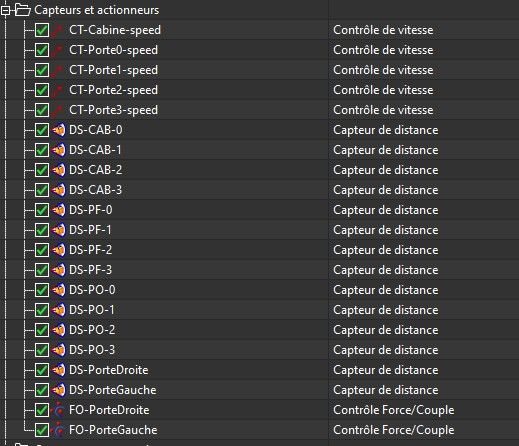

### 6. Création des signaux de contrôle

Nous allons maintenant configurer les signaux de contrôle des portes. Créez Un signal d'entrée booléen appelé `MOT_PC`.
Créer ensuite un signal de sortie appelé `CPT_PC`

Afin de facilité la simulation, nous allons créer un bloc d'expression dans les __comportement runtime__ afin de désactiver la force d'ouverture des portes.

Commençez par créer un __Bloc d'expression__ dans les __Comportement Runtime__. Ajouter ensuite une entrée booléen appelée __IN_MOT_PC__ puis assosciez là au signal d'entrée __MOT_PC__.

Créer ensuite 2 sortie booléene que vous assoscierez au paramètre : `actif` des contrôles de force d'ouverture.

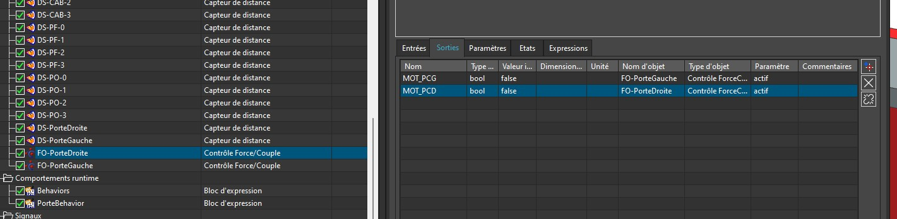

Dans l'onglet expression, ecrivez une formule permettant d'activé la force d'ouverture lorque le signal __MOT_PC__ est vrai.
Copier la même formule dans les deux sorties.

Créer ensuite un autre bloc d'expression pour que le signal CPT_PC retourne vrai lorsque les deux portes soient fermées.

### 6. Lien avec l'automate

Nous allons maintenant coupler la simulation avec l'automate.

Appelez si besoin le professeur pour démarer l'automate puis couplez les signaux existant avec les variables API.

Lancez ensuite la simulation et appelez le professeur pour validez rendre votre travail.
