# TP 5 : Prise en main NX Line Designer

## Objectifs
A partir des plans d'implantation de la ligne de production, et des plans de cotation des équipements, modéliser les équipements dans le but de réaliser le jumeau numérique de la ligne.

- [x] Création d'un convoyeur paramétrique
- [x] Création d'un chassis en profilé
- [x] Implatation des équipements 

## Matériel et logiciels nécessaires

- PC équipé avec : Siemens NX ( + Line Designer)

## Support pédagogique

Le département PAUC est en pleine rénovation. Vous participerez à la conception de la nouvelle ligne de production en réalisant les plans d'implantation de la nouvelle usine robotisée.

## Téléchargement 

- Télécharger le plan de cotation [profile.rail.droit.pdf](files/tp5/profile.rail.droit.pdf)
- Télécharger le template de projet [tp5.am.line.Prénom.NOM.zip](files/tp5/tp5.am.line.Prénom.NOM.zip)

## Travail à réaliser :

- [ ] Modéliser un rail de convoyeur droit
- [ ] Paramétrer un composant réutilisable
- [ ] Créer un composant réutilisable de rail courbe
- [ ] Réaliser une implantation à l'aide de la bibliothèque de composants

### 1. Création d'un nouveau projet

Pour commencer, créez un nouveau dossier sur la session. Renommez le dossier `tp5.am.line.Prénom.NOM` (ex : `tp5.am.line.Jules.TOPART`).

Nous allons commencer par créer un convoyeur paramétrique, réutilisable. Celui ci nous permettra de construire notre ligne de production très rapidement afin de tester plusieurs implantations en un minimum de temps.
Travailler avec des library de composant réutilisable prends très peu de temps et permet de capitaliser des modèles de composants pré-existant au fur et à mesure de vos projet.
Comme il s'agit d'un composant réutilisable, nous allons le sauvegarder dans un nouveau sous-dossier appelé `library`.

Après avoir créé le dossier, lancez __NX__.
Une fois que le logiciel NX est correctement démarré, cliquez sur l'icône __Nouveau__  en haut à gauche de l'interface.

!!! Warning
    Si NX ne se lance pas et affiche un message d'erreur lié à un problème de licence, suivez ce [tutoriel](../documentation/software/nx/nx-licence.md)

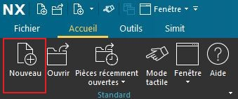

Dans le menu de création de fichier, sélectionnez  __Modèle__.

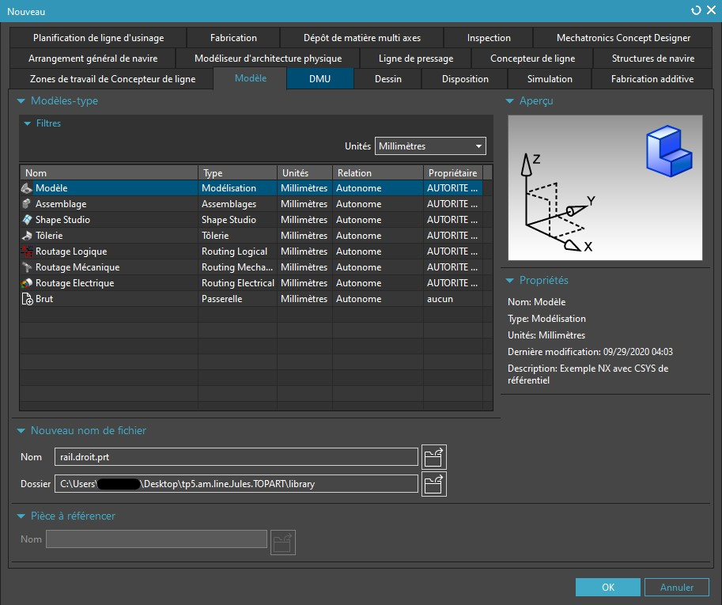

Renommez le fichier `rail.droit.prt` puis enregistrez le dans votre dossier `library`.
Cliquez ensuite sur __OK__.

### 2. Nouvelle esquisse

Pour modèliser la pièce, commencez par tracer cette esquisse, pour cela, il faut se rendre dans l'onglet __Accueil__ et cliquer sur __Esquisse__

Selectionnez le plan vertical __YZ__ puis validez.

!!! info
    Lors de la création d'une esquisse, NX crée immédiatement un nouveau système de coordonnées ayant l'axe Z pour normal au plan de l'esquisse. Tous les tracés de l'esquisse appartiendront au plan XY du système de l'esquisse.

Nous pouvons maintenant dessiner le profil du rail. Référez vous au plan de cotation pour dessiner le profil au bonne dimension.

En utilisant l'outil __Profil__, dessiner les contour du profil comme cela :

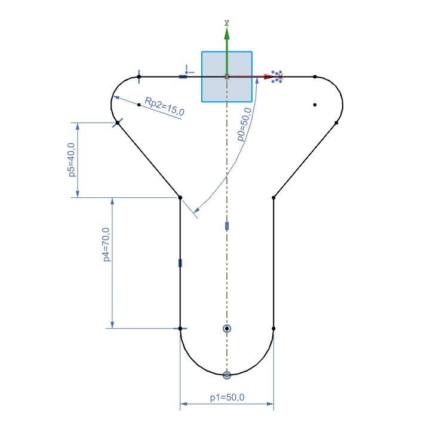

!!! info
    Utilisez ++esc++ pour quitter l'outil actif.
    La pièce est symétrique.

??? caution
    NX ajoute automatiquement des côtes à tout les objets d'une esquisse. Ces cotations sont flexible et aparaisse en gris clair. Vous pourrez donc déplacer les points et les segments à votre guise dans que le profile n'est pas contraint.
    Notons aussi que tous les objets sont positionnés par rapport à l'origine de l'esquisse. Il est parfois possible et/ou neccessaire de spécifier le point d'origine de  l'esquisse lors de sa création.

Pour créer des contraintes géométrique, il est possible de faire un __clic droit__ sur l'objet à contraindre puis de selectionner le type de contrainte approprié.
Pour créer la première cotation, faite un clic droit sur le segment en haut du profil puis cliquez sur l'icône de __Cote horizontal__.

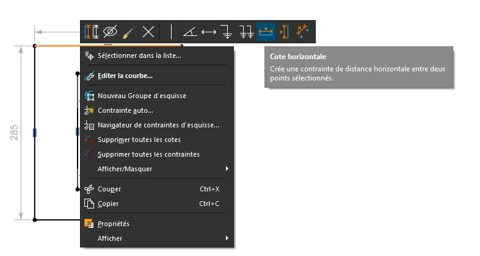

??? info
    Lorsque NX crée une cote, il y assoscie automatiquement un paramètre. Un paramètre en CAO est une variable modifiable à tout instant permettant de modifier une pièce automatiquement à la fin de la conception. Dans l'idéal, toute modèlisation devrait être paramétrique pour accélérer le cycle de conception.

N'hésitez pas à revoir le TP1 si vous avez des difficultés.

### 3. Extrusion

L'esquisse terminée, Il faut ensuite l'extruder. Pour cela, cliquez sur le button __Terminer l'esquisse__ (Drapeau noir et blanc).

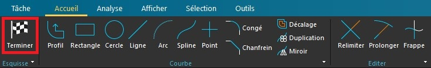

Cliquez ensuite sur __Extrusion__ puis selectionnez le profil que de la fourche.

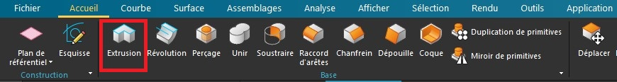

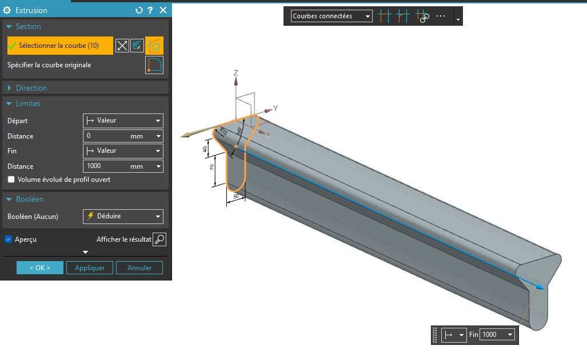

Une fois l'extrusion terminée, enregistrer la pièce dans votre dossier de travail.

### 4. Paramétres

Nous allons maintenant rendre cette pièce paramétrique. Pour cela, nous allons créer une nouvelle entrée dans la table des paramètres(Aussi appelée table des expressions).

Pour ouvrir les expressions, vous pouvez utiliser la barre de recherche située en haut à droite de la fenêtre NX ou bien taper ++ctrl++ + ++e++

Sur la première ligne du tableau, créer un nouveau paramètre `length` qui permettra de contrôler la longeur d'extrusion du rail. Initialisez sa valeur à 1200mm (1m20).

Fermer ensuite le tableau de paramètre, et modifier l'extrusion pour remplacer la valeur entrée à l'étape 3 par le paramètre `length`

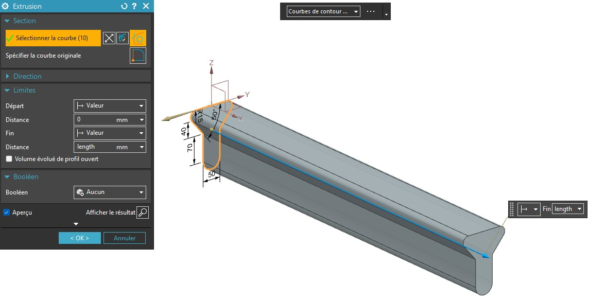

Désormais, lorsque vous changerez, la valeur dans le tableau d'expression, la longueur du rail sera également modifé.
Essayez par vous même !

### 5. Composants réutilisables

Dans le but déconomiser encore plus de temps. Nous allons maintenant faire en sorte que l'utilisateur n'ai plus besoin d'ouvrir la table des expressions pour faire varier la longueur du rail.

Nous allons pour cela créer un template de pièce réutilisable.
Commençez par recherche l'éditeur de PTS (Part template studio)

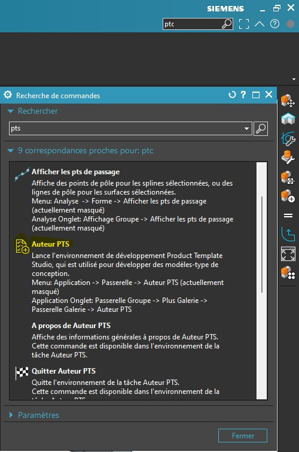

Vous devriez voir apparaître deux fenêtre désormais. La plus grande est l'éditeur de template. La plus petite est en fait la fenêtre qui s'affichera lorsque l'utilisateur importera votre pièce. Il est possible de personaliser cette fenètre pour choisir les paramètres lors de l'importation. 

Nous allons commencer par changer le titre de cette fenêtre. Pour cela, cliquez sur __Main Dialog__ et éditez la propriété titre.

Cliquez maintenant sur l'objet __Label__ et editez le texte d'aide.

Nous allons maintenant ajouter une entrée pour que l'utilisateur renseigne la longueur de rail désiré.
A gauche de l'interface, dans l'explorateur PTS, ajouter l'expression `length`.
Pour cela touver le paramètre `length` dans la rubrique `Expression` puis faite clic-droit et Add.

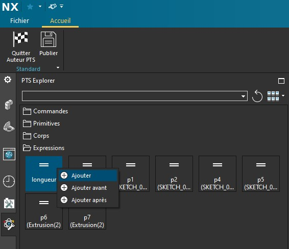

Un nouveau champs est apparu dans l'éditeur. Vous pouvez maintenant le personaliser.

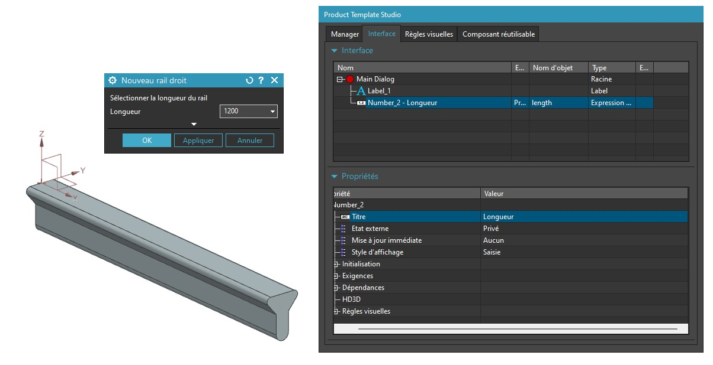

Puisqu'il s'agit d'une unité de longueur, nous allons restreindre les entrées possible afin que l'utilisateur renseigne une valeur en mm.

Éditez le paramètre `Style` et sélectionnez `Côte linéaire`

??? info
    Parfois il faut faire un clique droit sur la valeur pour accèder à toutes les valeurs possibles

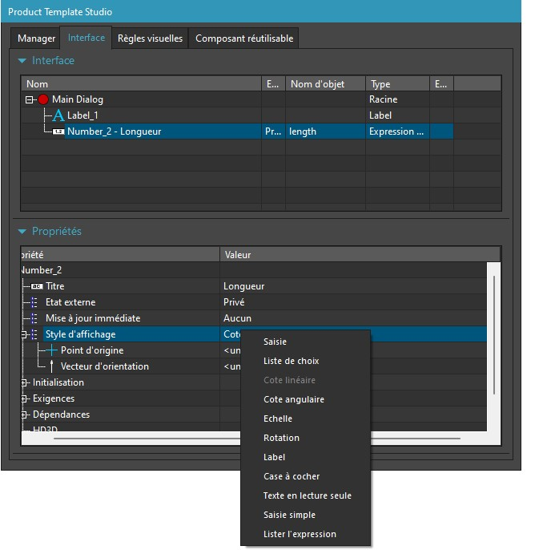

Selectionnez ensuite l'origin et la direction de la côte.
Ces deux paramètres servent uniquement pour la visualitation lors de l'import.

Selectionnez l'origin du profil.

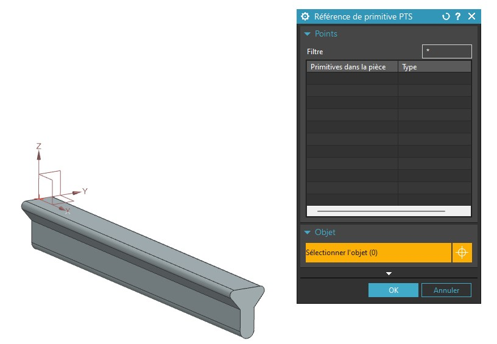

Puis, le vecteur X.

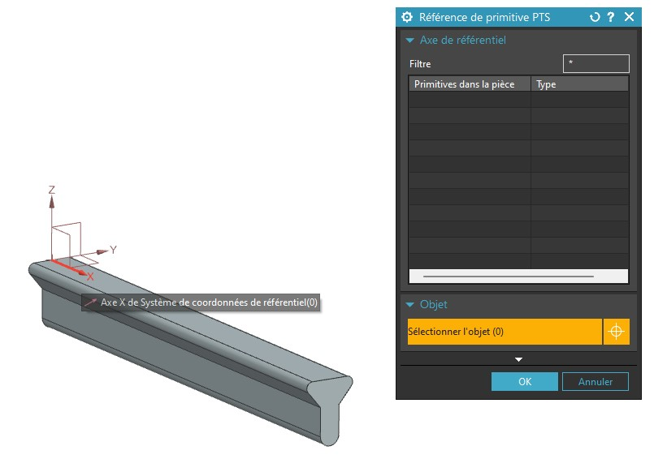

Il est aussi possible d'ajouter une image d'aide. Pour cela, ajouter un nouveau champ `Label control`

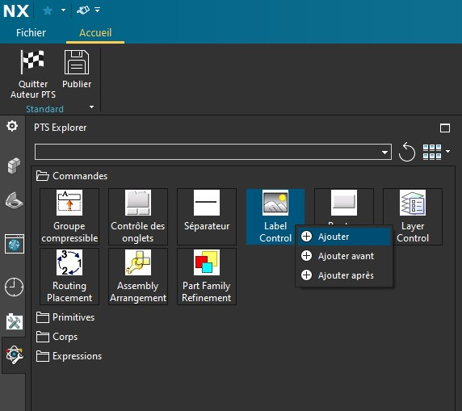

Puis personaliser à l'aide de cette image : [image BMP](files/tp5/info.bmp)

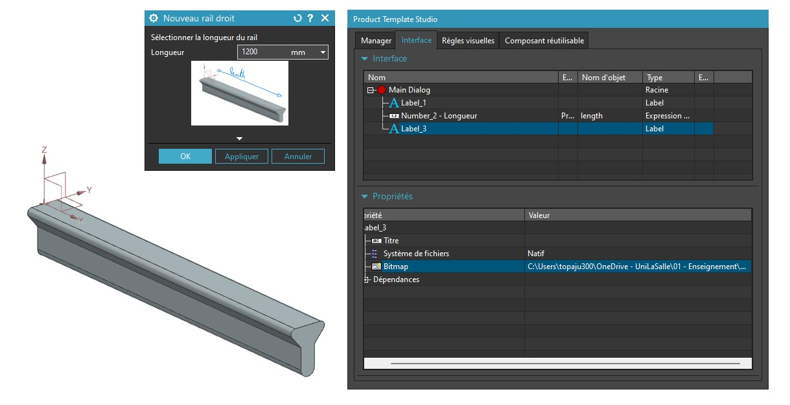

Pour finir vous devriez obtenir une fenêtre comme celle-ci : 

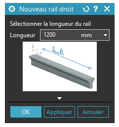

Nous allons également éditer deux autres paramètres pour forcer la fenêtre à apparaître lors de l'import du template. Pour cela,  editez les paramètres de `Main Dialog`: 

- Lancer Redéfinir les contraintes : vrai
- Autoriser l'accès rapide ... : Accès Rapide pour ...
  

Nous allons maintenant générer une nouvelle entrée dans la bibliothèque de composants en cliquant sur `Publier`

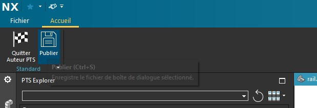

Vous pouvez maintenant quitter l'éditeur PTS

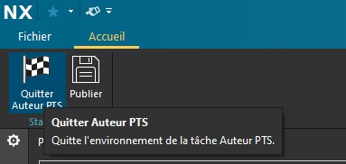

### 6. Connecteurs de placement rapide

Toujours dans l'optique de gagner du temps, il est possible d'automatiser le positionnement des éléments dans l'espace.
Pour cela, nous allons passer dans un nouvel environnement de travai : Line designer (Concepteur de ligne.)

Dans l'onglet application, rendez vous dans le menu concepteur de ligne et lancez l'application.

Nous allons d'abord créer un connecteur. Ces connecteurs nous permmetrons d'assembler les composants de manière très intuitive par la suite. Il s'agit simplement de décrire la façon dont nos pièces vont s'interfacer.

Dans l'onglet "Author" (Auteur), cliquer sur __Ajouter un connecteur__

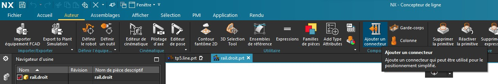

Nous allons maintenant positionner le connecteur d'entrée du rail. (Conventionnellement au début du rail dans le sens de déplacement du chariot)

Renommez le connecteur comme ci-dessous : 
Nous choisirons le Type __Tête__.

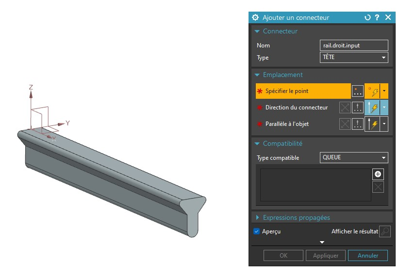

Ensuite nous allons spécifer l'origine du connecteur. C'est à dire l'endroit ou le rail précédemment terminera.

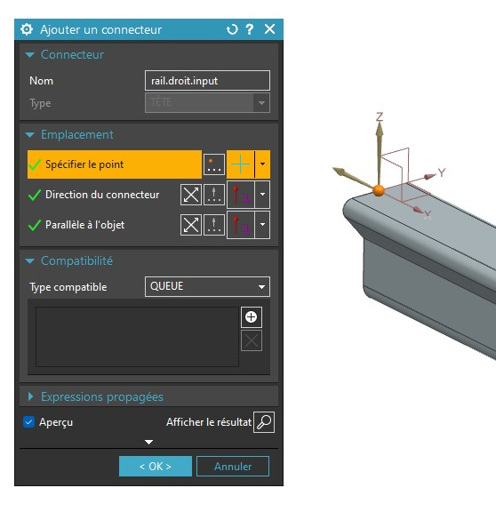

Ici vous pouvez utiliser le centre du segment horizontal de la face supérieur du rail. Dans ce contexte c'est aussi l'origine. Mais cela dépend de la position de votre profil d'esquisse réalisée à l'étape 1.

Ensuite, il nous faut selectionner le vecteur de rotation. Ce vecteur permet de donner l'orientation de la pièce à assembler.
Ici il faut selectionner le vecteur vertical Z. Afin que tout les rails soient orienté dans le même sens.

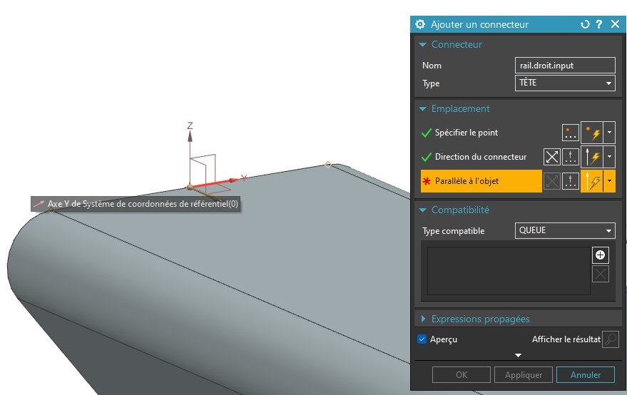

Norlalement vous devriez obtenir cette visualisation :

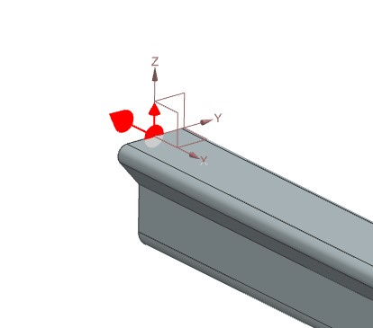

Répétez l'opération pour le connecteur de queue. En prenant soin d'orienter les vecteurs comme suis : 

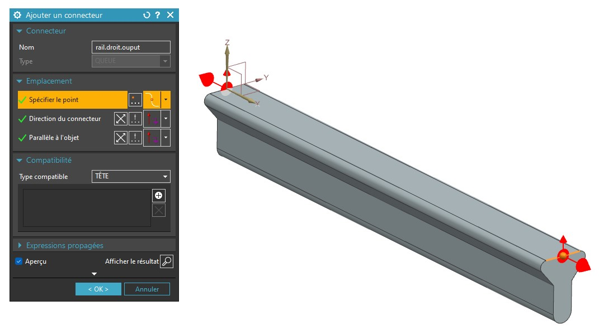

### 7. Rail courbe

Il est temps de mettre en pratique tout ce que vous avez appris jusqu'ici afin de créer un rail courbe paramétrique.
Le rail devra être entierement paramétré à l'aide de l'angle de virage et du rayon de courbure.

Commencer par modéliser le rail en ajoutant les paramètres dans la table d'expression.

Ensuite, créer le template de pièce réutilisable.

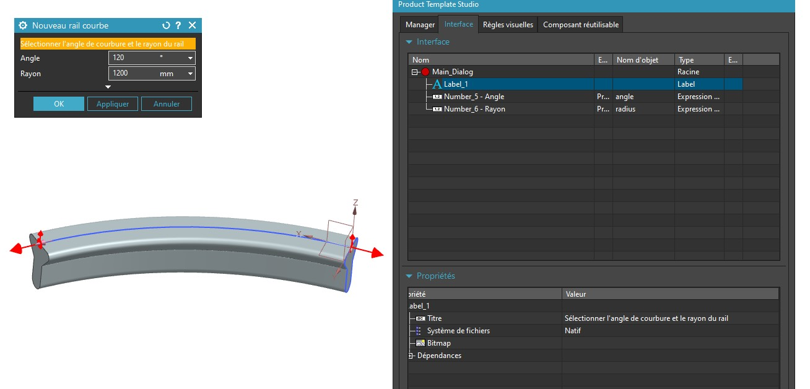

Enfin vous pourrez ajouter les connecteurs comme pour le rail droit. Attention à leur donner des noms cohérents.

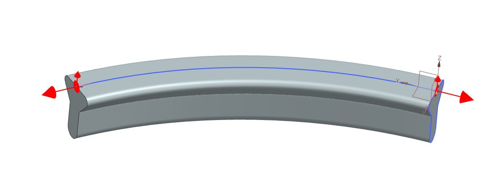

Pièces à réaliser : 

- [x] Rail droit
- [ ] Rail courbe
  - [ ] Modélisation
  - [ ] Paramétrage 
  - [ ] Template de composant réutilisable
  - [ ] Connecteurs d'assemblage automatique

### 8. Ligne de production

Nous avons créer tout ce dont nous avons besoin pour commencer l'implantation de la chaine de production.
Nous allons maintenant réaliser importer nos library de composant et commencé à les disposer.

Commençons par créer un nouveau projet. Pour cela, dans l'onglet fichier, créer une nouvelle pièce en selectionnant le type équipement dans l'onglet concepteur de ligne.

Une fois l'environnement de conception de ligne de production ouvert, nous pouvons ajouter notre library.
Dans l'explorateur sur la gauche de l'interface, ouvrez le volet bibliothèque.

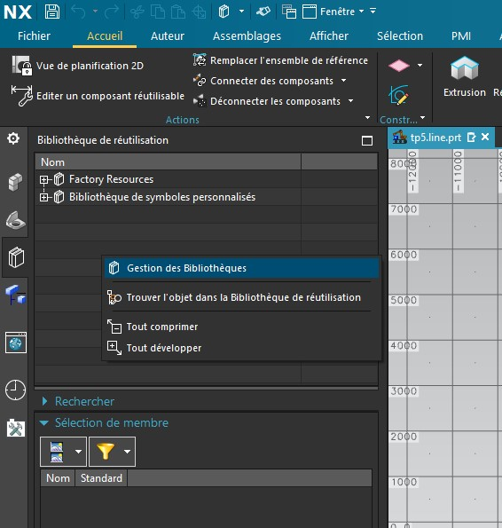

Ajouter ensuite une nouvelle library en cliquant sur la première icône

Puis naviguer jusqu'au dossier `library` dans votre dossier projet.

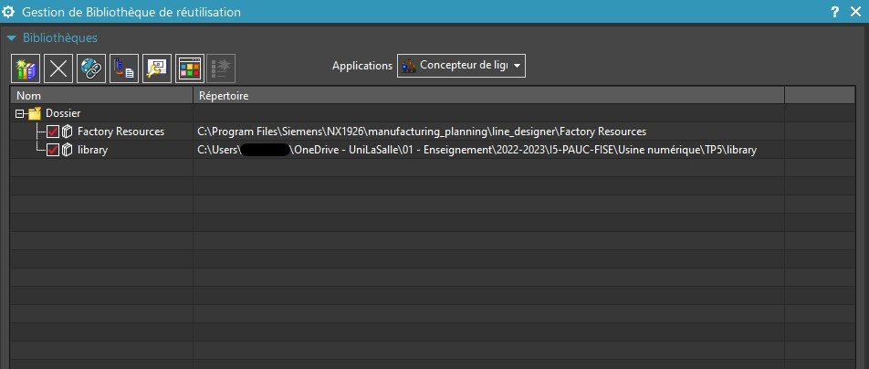

Fermer ensuite le gestionnaire de bibliothèque et selectionner la librairie quevous venez d'ajouter.
Vous devrier maintenant trouver vos deux rails.

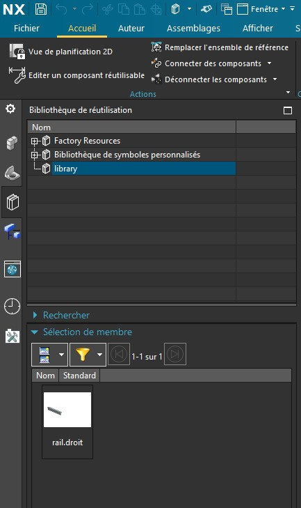

Essayer maintenant d'importer vos rail en utilisant les connecteurs pour les assembler. Pour cela, faite un glisser déposer de la librarie vers le connecteur du rail cible.

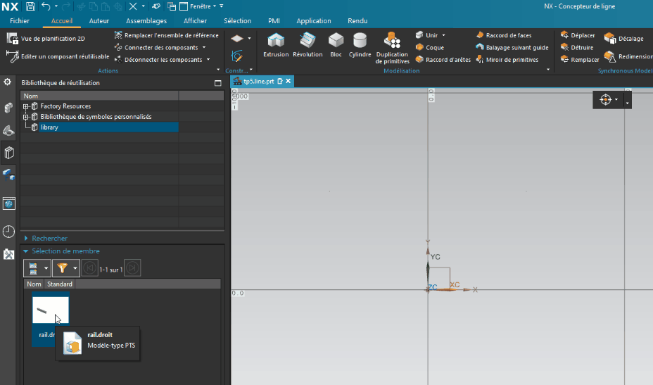

En utilisant votre librarie et la librarie standard. Réalisez l'implantation d'une usine factice.

Votre ligne de production devra comprendre :

- 2+ Rails droits
- 2+ Rails courbes
- 1+ Robot

Facultatif : 
- Réaliser une cage de sécurité
- Sur-élever le robot
- Créer des pieds au rails en modifiant votre librairie
- Importer un mannequin

Afin de faciliter l'implantation, vous pouvez travailler en vue de dessus. Passer en 3D seulement lorsque tout vos composants seront importé.

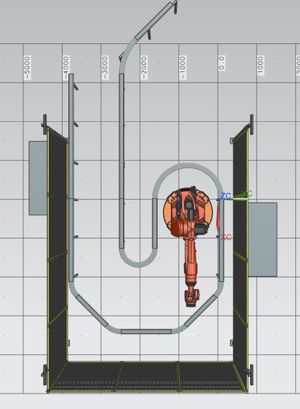

Prener une capture d'écran de votre usine et placer la dans votre dossier de travail.

Appelez le professeur pour validation et commentaires.

Bravo ! :)
