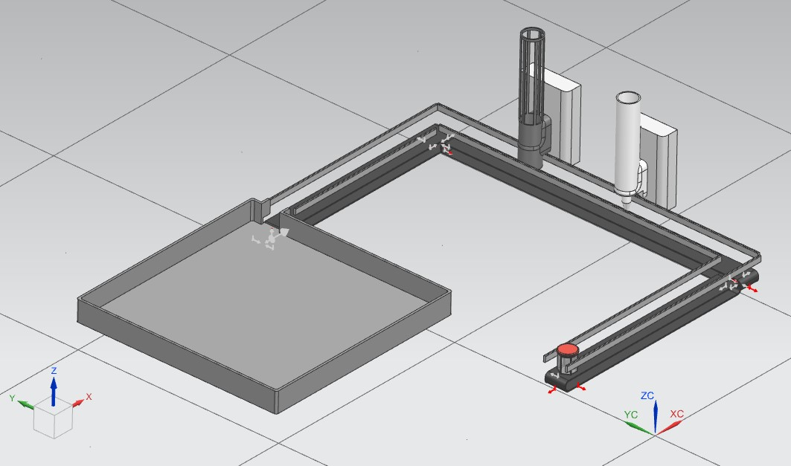
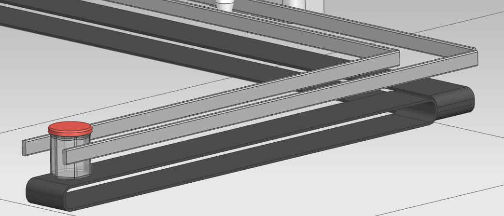
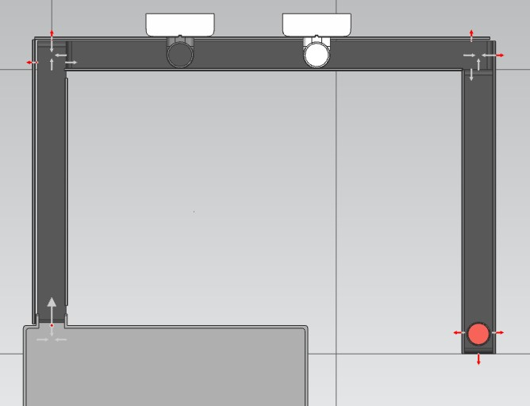
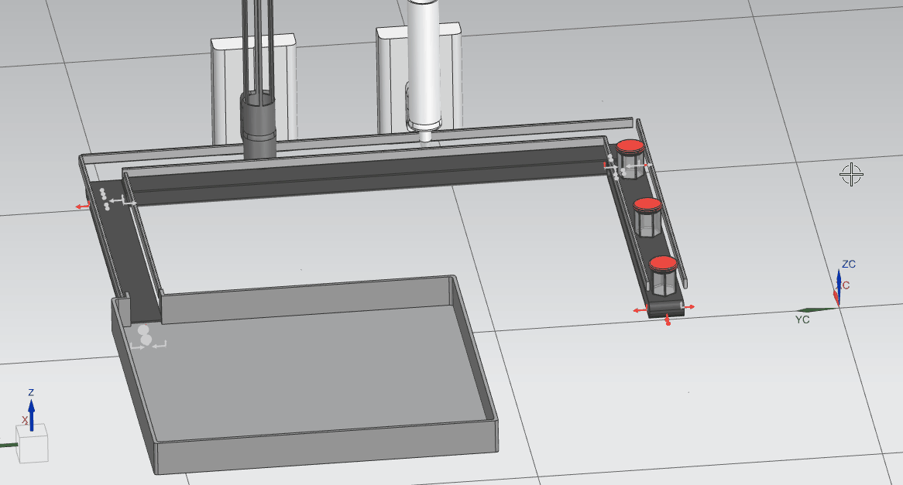
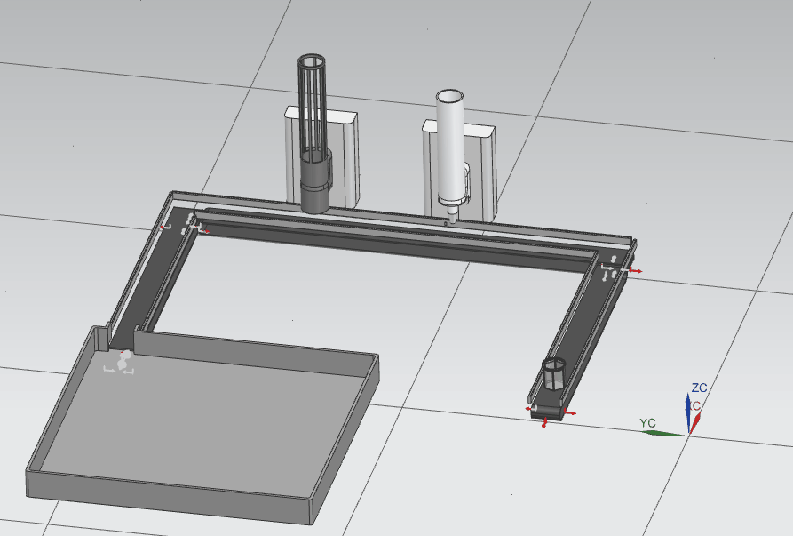

# TP 7 : Simulation de ligne de production de confiture

## Objectifs
A partir des bibliotèques de composants, réaliser l'assemblage et la simulation d'une ligne de production puis simuler le conditionnement. À l'aide du séquenceur, réaliser l'animation de la ligne.

- [x] Importer une librairie
- [x] Modèliser un convoyeur paramétrique
- [x] Implanter une chaîne de production
- [x] Simuler les convoyeurs
- [ ] Programmer les séquences d'animation (+Bonus)

## Matériel et logiciels nécessaires

- PC équipé avec : Siemens NX ( + Line Designer & Mecatronics concept designer)

## Téléchargements

- [Librairie du projet](./files/tp7/library.zip)

## Travail à réaliser :

- [ ] Modéliser un convoyeur droit de (100mm de large x 50mm de haut x `length` de long)
- [ ] Paramétrer un composant réutilisable
- [ ] Créer un composant réutilisable de convoyeur
- [ ] Réaliser une implantation à l'aide de la bibliothèque de composants
- [ ] Réaliser l'animation de la chaîne de production

### 1. Création d'un nouveau projet

Pour commencer, créez un nouveau dossier sur la session. Renommez le dossier `tp7.pot.line.Prénom.NOM` (ex : `tp7.pot.line.Jules.TOPART`).

Télécharger ensuite la librairie disponible dans les téléchargements puis l'extraire dans votre dossier de travail.

!!! Warning
    Si NX ne se lance pas et affiche un message d'erreur lié à un problème de licence, suivez ce [tutoriel](../documentation/software/nx/nx-licence.md)

### 2. Modélisation d'un convoyeur paramétrique

Vous commencerez par modéliser un convoyeur de 100mm de large, 50mm de haut. Sa longueur devra être paramétrique en réalisant un modèle PTS comme dans le TP 5.

Ajouter ensuite les connecteurs, comme dans le TP5

### 3. Implantation

A l'aide de la librairie, disponible dans les téléchargements, réaliser l'implantation suivante sans soucis de dimmensions.

### 4. Simulation

Vous réaliserez ensuite la simulation pour obtenir le comportement suivant : 

### 5. Animation

Afin de simuler l'automatisation de la ligne, nous utiliserons le séquenceur pour arrêter et activer les machines afin de simuler le remplissage et la fermeture des pots.

