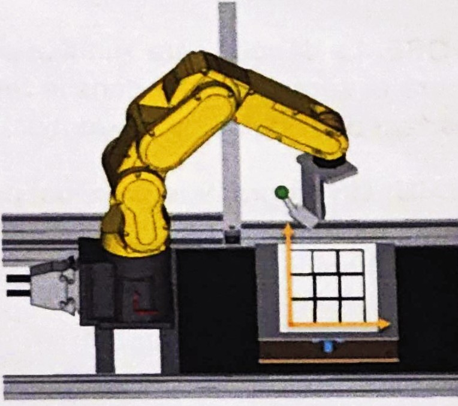

# TP 2 FANUC: Palletisation

Ce TP a pour but de simuler un programme de paletissation. Au lieu d'empiler des boites, vous allez dessiner des carres 60x60mm sur le plan incliné. Ces carrés seront dessinés sequentiellement avec une phase de "prise" virtuelle du carré dans un point donné du space de travail et une phase de depose (dessin du carré sur le plan).  Il vous est demandé de faire un programme, faisant appel à plusieurs sous-programmes, répondant aux contraintes suivantes.

Attention, il n'est pas question d'appeler 9 fois le programme du carré dans le programme MAIN. Il faudra l'ecrire une seule fois et faire appel à des boucles et des OFFSET.

Avant de commencer le TP sur le robot, il faudra réflechir et poser le probleme sur papier/tablette/ordi afin de choisir la meilleure strategie pour la création du programme. Il est conseillé de reflechir à l'algorithme (en pseudo-code) au préalable.

# Sous-programmes:

- **INIT_NOMGROUPE:** Toutes les variables (Registres R[] et Registres de Position PR[]) seront initialisées dans un programme INIT.
- **REPLI_NOMGROUPE:** Un programme REPLI emmènera le robot en position: 0° sur tous les axes en JOINT
- **PRISE:** Afin de simuler une action de prise par le robot, creez un programme qui vient pointer avec le marqueur sur un point proche de la paroi en plexiglass en face du robot (attention au DCS!)
- **POSE:** La dépose sera simulée par le dessin d'un carré et sera effectuée dans le repere du plan incliné
- **MAIN:** Un programme principal permettra de faire effectuer au robot un agencement de carrés 3 lignes et 3 colonnes comme le dessin ci-dessous.
- {.align-left}

## Bonus

Si vous avez le temps, il faudra modifier le programme de façon à qu'il simule l'empilement de cartons en ajoutant une troisième dimension, l'axe Z.

