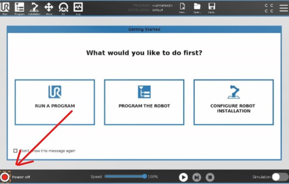
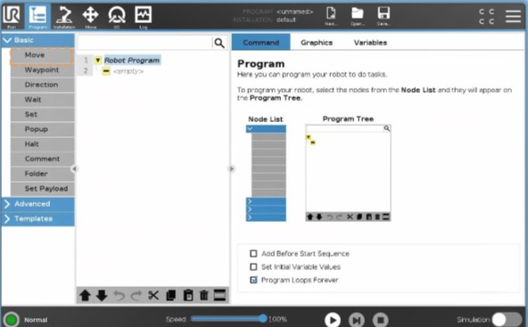
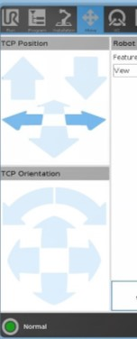
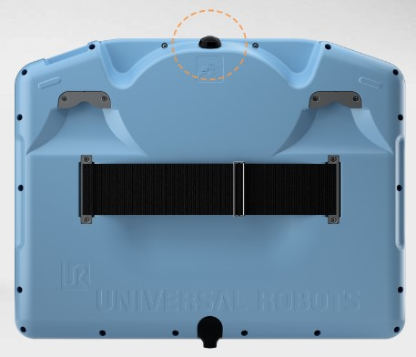
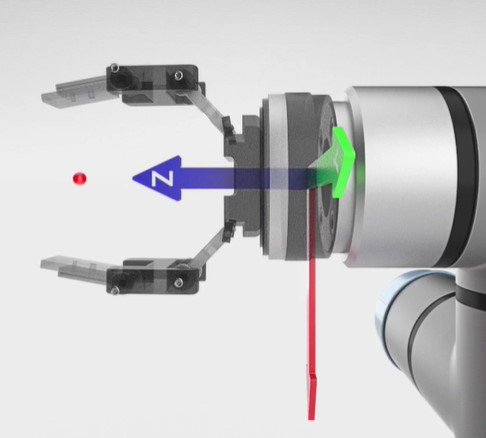
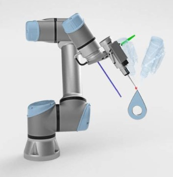

# **Robotique & Cobotique**
## Découverte et prise en main

## Qu'est-ce que la Cobotique ?

La cobotique, ou robotique collaborative, fait référence à l'utilisation de robots collaboratifs (cobots) qui travaillent en étroite collaboration avec les humains dans un environnement partagé. 

Contrairement aux robots industriels traditionnels, les cobots sont conçus pour être sûrs, flexibles et faciles à programmer, ce qui permet une intégration plus fluide dans les processus de production et autres applications. Leur capacité à interagir de manière sécurisée et productive avec les travailleurs humains en fait un atout précieux pour de nombreuses industries.

## Universal Robots - UR10-e series

Universal Robots est un leader mondial dans le domaine de la cobotique, offrant une gamme de robots collaboratifs faciles à déployer et à programmer. 
Le modèle UR10-e est l'un de leurs cobots les plus populaires, réputé pour sa polyvalence et sa capacité de charge utile élevée. Il est particulièrement apprécié pour les tâches qui nécessitent une portée plus longue et une précision accrue, telles que l'assemblage, le pick-and-place, l'emballage et la palettisation.

Le UR10-e est équipé d'une interface utilisateur intuitive et d'outils logiciels avancés qui permettent même aux utilisateurs sans expérience préalable en robotique de créer des programmes de mouvement complexes. Sa conception ergonomique et ses fonctionnalités de sécurité intégrées assurent une interaction sûre avec les opérateurs humains, réduisant ainsi le risque d'accidents et augmentant l'efficacité globale.

Le UR10e est un robot industriel à 6 axes capable de déplacer une charge utile allant jusqu'à 10 kg. Ses vitesses de déplacement maximum sont relativement faibles, car il est conçu pour opérer sans protection intégrale, contrairement aux robots classiques.

{.img-medium}

---

## Objectifs
Le UR10e est un robot industriel à 6 axes capable de déplacer une charge utile allant jusqu'à 10 kg. 

Ses vitesses de déplacement maximum sont relativement faibles, car il est conçu pour opérer sans protection intégrale, contrairement aux robots classiques.

- [x] Comprendre le fonctionnement d'un robot
- [x] Explorer les différents types de mouvement
- [x] Réaliser et tester des chemins programmés pour le robot

## Matériel et logiciel nécessaire

- Robot Universal robot UR10-e series
- Parcours d'entrainement 1 [PDF](./files/tp.bvs.ur/tp.ur.1.pdf)
- Parcours d'entrainement 2 [PDF](./files/tp.bvs.ur/tp.ur.2.pdf)

---

## Travaux Pratiques

Dans cette activité, vous allez découvrir les bases du fonctionnement d'un cobot industriel. Vous allez apprendre à manipuler le robot et à comprendre ses composants principaux.

---

Vous avez sûrement remarqué la petite tablette de contrôle devant vous, (aussi appelée le Pendant).

{.img-medium align=right}

C'est depuis cette tablette que vous contrôlerez le robot. Elle permet de dialoguer avec ce dernier en créant des programmes et en définissant des points de passage.

Si le robot est éteint, vous pouvez l'allumer en appuyant sur le bouton `Power`.

 
 

!!! warning
    Pendant l'allumage, prenez un moment pour identifier les boutons d'arrêt d'urgence présents autour de vous. En cas de problème pendant le TP, vous êtes autorisé à faire usage de l'un de ces boutons en cas de danger ou pour éviter d'endommager le matériel. Sachez toutefois que, de par sa nature, le cobot détecte les collisions, et donc, il s'arrêtera lors d'une collision. Bien qu'il ne puisse pas vous blesser gravement, il peut toutefois vous coincer ou vous heurter. Soyez donc prudent, cela reste une machine sans cervelle !

Une fois le robot allumé, vous remarquerez plusieurs onglets en haut de l'interface. Vous pourrez y trouver les onglets suivants :

Un fois le robot allumé vous remarquerai plusieurs onglet en haut de l'interface. Vous pourrez y trouver les onglets suivants : 

- Accueil
- Programmation
- Page de configuration (installation)
- Contrôle et déplacement
- Gestion des E/S (Entrées / Sorties)
- Journal

### Initialisation

Afin d'initialiser le robot, vous devez alimenter ses moteurs et relâcher les freins. Pour cela, rendez-vous dans le menu d'initialisation en cliquant sur le cercle rouge (parfois vert) situé en bas à gauche de l'écran.

Appuyez maintenant sur le bouton `ON`, puis cliquez sur `Démarrer` pour relâcher les freins.
Le robot est maintenant sous tension. 

!!! failure "Problème"
    Si le robot ne démarre pas, c'est probablement dû à un arrêt d'urgence externe. En effet, les cobots de l'usine-école font partie d'un ensemble cohérent et sont intégrés dans la chaîne de fabrication. Il arrive parfois qu'un défaut apparaisse, le plus souvent à cause d'un arrêt d'urgence enfoncé quelque part. Vérifiez les arrêts d'urgence et appelez le professeur pour débloquer la situation en toute sécurité.

Vous pouvez maintenant fermer la fenêtre d'initialisation à l'aide du bouton en bas à gauche de la fenêtre.

### Programmer le robot

Cliquez maintenant sur le bouton du milieu : `Programmer le robot`. Vous pouvez aussi accéder au programme en utilisant les onglets en haut de l'écran.

Vous remarquerez que la page est divisée en trois parties. Sur la gauche, vous trouverez les "boîtes à outils" contenant les différentes instructions de programmation permettant de contrôler le robot.
Au centre, votre programme, et sur la droite, la fenêtre de configuration des commandes.

Les commandes sont exécutées de manière séquentielle, ce qui signifie qu'elles s'exécutent de haut en bas les unes après les autres.

Commençons un nouveau programme. Dans le premier tiroir de la boîte à outils, sélectionnez le bloc `Move`. Ce premier bloc nous permettra, comme son nom l'indique, de déplacer le robot.
Vous remarquerez qu'un bloc `Waypoint` a été ajouté automatiquement. Il s'agit d'un point de passage. Vous pouvez en ajouter plusieurs dans chaque commande de déplacement afin de créer des trajectoires complexes que le robot pourra suivre.

{ align=right}

Cliquez sur le `Waypoint` puis cliquez ensuite sur `Définir le point de passage`.

Maintenant, vous pouvez utiliser les flèches de droite et gauche pour déplacer le robot. Ce menu est assez intuitif car il permet de déplacer le robot dans le même sens que vous le voyez sur l'écran du Teach pendant. Pour être sûr que le robot se déplace bien dans la bonne direction, alignez la vue 3D du robot pour la faire correspondre avec le robot tel que vous le voyez.

Cliquez ensuite sur `OK` pour valider le point de passage.

Bravo ! Vous avez créé votre premier point de passage.

---

Le robot UR étant un cobot, vous vous demandez sûrement pourquoi nous ne pourrions pas le déplacer manuellement.
Et bien, vous pouvez ! Pour cela, appuyez sur le bouton au-dessus du Teach pendant. Pour un confort optimal, vous pouvez passer votre main dans la sangle située à l'arrière du pendant.

Ainsi, vous pouvez utiliser votre avant-bras comme support de la tablette et accéder facilement au bouton `Teach`.
Essayez de déplacer le robot après avoir pressé le bouton.

Essayez de créer quelques déplacements et cliquez ensuite sur le bouton Play en bas de l'interface pour exécuter le programme. Attention aux collisions !

### Définir un outil

Lors de l'utilisation du cobot, il est souvent nécessaire de configurer un outil. Pour cela, vous devez fournir au robot les informations géométriques de l'outil qu'il utilise afin de lui permettre d'attraper des objets plus facilement.

On définit généralement un outil en créant un point central d'outil (PCO) (ou TCP en anglais).

Il s'agit du point médian des points de contact de l'outil. Si l'outil est un crayon, le PCO est situé à son extrémité.
Pour une pince, le TCP est situé entre les deux mors.

Lors de la création d'un PCO, nous créons en fait un repère. C'est le repère de l'outil. Ce repère est défini par trois axes X, Y et Z.

Par défaut, le repère outil est situé à l'extrémité du robot.

Rendez-vous dans l'onglet `Installation` pour créer un nouvel outil. Cliquez ensuite sur TCP.

Mesurez ensuite votre outil à l'aide d'une règle ou d'un pied à coulisse puis reportez les dimensions dans le menu de configuration sur le pendant. (Attention aux unités !)

Il est possible de mesurer automatiquement les dimensions de l'outil. Pour cela, vous pouvez utiliser l'utilitaire de TCP en cliquant sur le bouton avec la baguette magique.

Il vous faudra alors déplacer le robot à trois positions différentes de façon à ce que le TCP de l'outil arrive toujours au même endroit. Il est utile de définir un repère visuel statique pour maximiser la précision des mesures. Essayez de choisir un coin ou un repère clair comme référence pour positionner votre robot.

Il est possible de répéter une procédure similaire afin de calculer l'orientation de l'outil en alignant l'axe Z du TCP avec la verticale.

Ensuite, vous pouvez définir la masse de l'outil. Bien que cette masse ne soit pas vraiment nécessaire pour les déplacements du robot, il est important de comprendre pourquoi la masse de l'outil a une grande importance pour un cobot.

Afin de détecter les collisions et de permettre à l'utilisateur de le déplacer manuellement, les cobots intègrent des capteurs de force. Ces capteurs permettent de mesurer les forces appliquées sur le robot afin de décider dans quelles directions sedéplacer pendant le contrôle manuel. Le problème c'est que la gravité est toujours présente et elle doit donc être prise en compte lors du calcul. Ainsi le robot compense continuellement la force de gravité pour se déplacer uniquement dans la direction souhaité par l'utilisateur. Sans connaitre la masse de son effecteurs, le robot ne peut pas compenser efficacement la gravité et risque de tomber ou de monter indéfiniment.

Pour calibrer la masse de l'outil rendez-vous dans l'onglet `PayLoad`
Cliquez sur mesurer puis suivez la procédure.

Bravo ! Vous avez paramétré un outil !

Maintenant vous êtes en mesure de préciser au robot dans quel repère vous souhaitait travaillé. Si vous appliquez le TCP défini précédemment, le robot l'utilisera comme référence pour ses mouvements, vous permettant de le programmer précisément.

### Les mouvements

Le robot UR10-e de Universal Robots permet de programmer différents types de mouvements pour accomplir une variété de tâches. Voici une explication des principaux types de mouvement que vous pouvez utiliser :

#### Mouvement Linéaire (MoveL)
Le mouvement linéaire (MoveL) permet de déplacer l'outil du robot d'un point A à un point B en suivant une ligne droite. Ce type de mouvement est idéal pour les tâches qui nécessitent une trajectoire précise et directe.

##### Caractéristiques :
- Trajectoire droite entre deux points
- Utilisé pour les opérations de pick-and-place
- Maintient l'orientation de l'outil constante tout au long du mouvement

##### Exemple d'utilisation :
Pour déplacer un objet d'une table à une autre en ligne droite.

#### Mouvement Articulaire (MoveJ)
Le mouvement articulé (MoveJ) permet de déplacer l'outil du robot d'un point A à un point B en utilisant les articulations du robot. Ce type de mouvement est souvent plus rapide que le mouvement linéaire, mais la trajectoire peut être courbée.

##### Caractéristiques :
- Utilise les axes de rotation du robot
- Souvent plus rapide que le mouvement linéaire
- La trajectoire n'est pas nécessairement une ligne droite

##### Exemple d'utilisation :
Pour repositionner rapidement l'outil du robot d'une position de repos à une position de travail.

#### Mouvement Circulaire (MoveC)
Le mouvement circulaire (MoveC) permet de déplacer l'outil du robot le long d'un arc de cercle défini par trois points : le point de départ, un point intermédiaire et le point d'arrivée. Ce type de mouvement est utile pour les opérations qui nécessitent une trajectoire courbée.

##### Caractéristiques :
- Trajectoire en arc de cercle
- Nécessite la définition d'un point intermédiaire
- Utile pour les opérations de soudage ou de peinture

##### Exemple d'utilisation :
Pour tracer un arc ou un cercle sur une surface.

#### Mouvement Planifié (Path)
Le mouvement planifié permet de définir une trajectoire complexe en combinant plusieurs points de passage. Ce type de mouvement est utilisé pour les tâches nécessitant une grande précision et une trajectoire spécifique.

##### Caractéristiques :
- Combinaison de plusieurs points de passage (waypoints)
- Permet de créer des trajectoires complexes
- Utilisé pour les opérations de précision telles que l'assemblage ou la soudure

##### Exemple d'utilisation :
Pour suivre une trajectoire complexe lors de l'assemblage d'un produit.

---

### Configuration des Types de Mouvement

Pour configurer ces types de mouvement dans le logiciel de programmation du robot UR10-e, vous devez sélectionner le type de mouvement approprié dans la boîte à outils et définir les points de passage nécessaires.

1. **Sélection du Type de Mouvement :**
   - Ouvrez la boîte à outils dans le logiciel de programmation.
   - Sélectionnez le type de mouvement souhaité (MoveL, MoveJ, MoveC, ou Path).

2. **Définition des Points de Passage :**
   - Cliquez sur le type de mouvement sélectionné pour l'ajouter à votre programme.
   - Définissez les points de passage en utilisant les commandes disponibles.
   - Validez chaque point de passage pour construire votre trajectoire.

3. **Exécution du Programme :**
   - Une fois les points de passage définis, sauvegardez et exécutez le programme.
   - Observez le mouvement du robot et ajustez les paramètres si nécessaire pour optimiser la trajectoire.

### II - Exercice Pratique : Suivi de Ligne

Dans le cadre de cet exercice, vous allez démontrer votre maîtrise des déplacements du robot en créant un programme de suivi de ligne. Vous devez utiliser les connaissances acquises précédemment pour définir un point central d'outil (PCO ou TCP) et programmer le robot pour qu'il suive une ligne de manière précise.

Deux feuilles de parcours avec des niveaux de difficulté différents vous sont fournies. Vous devez programmer le suivi des lignes de la manière la plus propre possible, puis appeler le professeur pour validation.

#### Travail à réaliser :

1. **Créer un nouveau programme :**
   - Ouvrez le logiciel de programmation du robot.
   - Créez un nouveau projet en sélectionnant l'option appropriée dans le menu.

2. **Définir un Point Central d'Outil (PCO/TCP) :**
   - Rendez-vous dans l'onglet `Installation` et sélectionnez `TCP`.
   - Mesurez votre outil à l'aide d'une règle ou d'un pied à coulisse.
   - Reportez les dimensions de l'outil dans le menu de configuration.
   - Utilisez l'utilitaire de TCP si nécessaire pour mesurer automatiquement les dimensions.

3. **Configurer le programme de suivi de ligne :**
   - Sélectionnez le type de mouvement `MoveL` pour garantir un déplacement linéaire.
   - Utilisez la boîte à outils pour ajouter des points de passage (`Waypoints`) le long de la ligne à suivre.
   - Définissez chaque point de passage en utilisant les flèches pour déplacer le robot avec précision.
   - Assurez-vous que le robot suit la ligne de manière fluide et sans déviations.

4. **Tester et ajuster le programme :**
   - Exécutez le programme en mode simulation pour vérifier la trajectoire.
   - Ajustez les points de passage si nécessaire pour améliorer la précision du suivi de ligne.

5. **Validation :**
   - Une fois le programme finalisé et testé, appelez le professeur pour valider votre travail.
   - Le professeur vérifiera la précision et la fluidité du suivi de ligne.

#### Liste de tâches :

- [ ] Ouvrir le logiciel de programmation et créer un nouveau projet
- [ ] Définir le TCP de l'outil utilisé
- [ ] Configurer le type de mouvement `MoveL`
- [ ] Ajouter et définir les points de passage le long de la ligne
- [ ] Exécuter le programme en mode simulation
- [ ] Ajuster les points de passage pour un suivi précis
- [ ] Tester le programme sur le robot
- [ ] Appeler le professeur pour validation

En suivant ces étapes, vous serez en mesure de démontrer votre maîtrise des déplacements du robot et de la programmation des mouvements. Bonne chance !

---

<!-- 
Nous avions 4 chemins à réaliser :

- Un premier chemin, ici en bleu
- Un deuxième chemin, ici en violet
- Un troisième chemin, ici en jaune
- Un quatrième chemin, ici en rose

### Chemin Bleu
Le chemin bleu fait le tour du plan en utilisant des mouvements linéaires pour les droites et des mouvements circulaires pour les courbes.

### Chemin Violet
Le chemin violet utilise des arrondis avec 3 mouvements linéaires et 3 mouvements circulaires.

### Chemin Jaune
Le chemin jaune est un cercle utilisant un mouvement circulaire contenant 4 points intermédiaires.

### Chemin Rose
Le chemin rose ressemble au symbole de l’infini, utilisant 3 mouvements linéaires et 2 mouvements circulaires.

Nous avons réalisé ces chemins un à un, puis finalement nous avons créé un programme qui réunissait chaque chemin en sous-programme afin que le robot les effectue à la suite.

[Vidéo du programme final](https://youtube.com/shorts/ELgOFAKixbU?feature=share)

---

## Travaux Pratiques numéro 2 - 6 décembre

Durant cette deuxième séance de 4 heures, nous avons expérimenté de nouveaux chemins en incluant une nouveauté : le lissage. 

### Chemin Vert
Le chemin vert en dent de requin avec 5 passages aller-retour, en ajoutant et adaptant le lissage à chaque passage.

Nous avons rencontré des difficultés avec les points d’approche et de sortie de chaque fin de chemin, que nous avons corrigées. Le lissage ne pouvait pas dépasser 29 mm pour maintenir la tangence.

[Vidéo du premier chemin lissé à 28mm](https://youtu.be/3ew3rhtOqTs)

---

## Travaux Pratiques numéro 3 - 11 décembre

Nous avons débuté par le chemin rouge lors de cette séance. Nous avons programmé le plan en comprenant l’erreur initiale : le programmer à partir de la base et non de l’outil.

### Chemin Rouge
Ce chemin comporte uniquement des mouvements linéaires accompagnés de lissage pour une vitesse constante, avec un symbole en “dents de requins”.

[Vidéo du chemin finalisé](https://youtu.be/Iy3DE5gGFrM)

---

## Travaux Pratiques numéro 4 - 21 décembre

Nous avons mis en œuvre nos compétences dans un exercice ludique pour faire suivre le chemin au PCO sans qu’il touche le fil de fer continu.

Nous avons renseigné le plan par rapport à l’outil avec l’aide du pendant, en utilisant des mouvements linéaires accompagnés de lissage, sauf pour une partie circulaire.

[Vidéo du chemin finalisé](https://youtu.be/uBxb_oEfM0o)

Dans la vidéo, on voit bien que le robot a une vitesse constante et réalise le chemin en ne touchant presque jamais le fil de fer, avec un seul problème mineur sur le mouvement circulaire. -->
