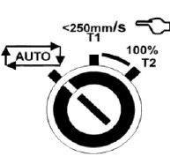
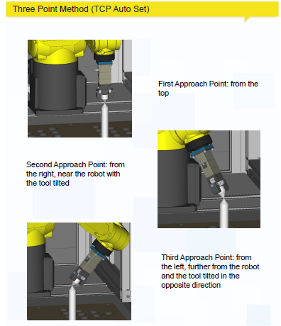
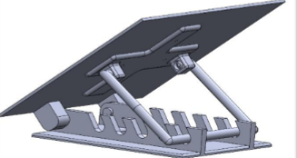
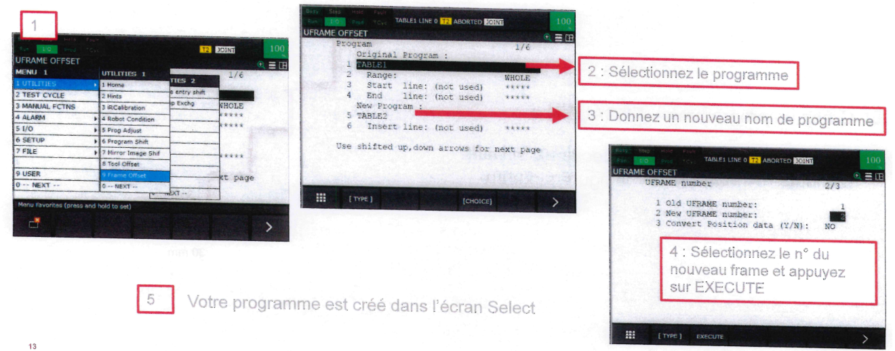
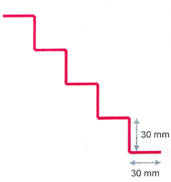

# TP 1 FANUC: Initiation

{.align-center .img-medium}

Veuillez-vous référer aux ressources pour connaitre les caractéristiques et mode d'emploi des robots FANUC

<!-- INSERER LIEN VERS RESSOURCES FANUC -->

## 1. Prise en main du robot

- Identifiez votre robot et ses références (numéro de série, type de robot, modèle, etiquette des points accessibles par le robot)
  
- Allumez le robot et passez en mode manuel (mode T1 sur la baie du robot + sélecteur en haut à gauche du Teach en position **ON**)

- {.align-left}

- **LIRE** Les dernières pages du mode d'emploi décrivant la fonctionnalité de chaque touche du TEACH de façon détaillée afin de connaitre leur emplacement et fonctionnalité. **[Mode d'emploi](./files/tp.bvs.fanuc/Ressources_Fanuc.pdf)**

## 2. Types de déplacement

- Ouvrir le PDF du mode d'emploi et lire la description de l'ensemble de types de déplacement

- Utilisez la touche COORD afin de changer les différents modes de déplacement du robot

- Acquittez les défauts et testez les modes de déplacement manuels avec le Jog Assist. Appuyez sur l'icone {.align-left}

- Choisir JOG ASSIST
  
## 3. Mise à 0° des axes et visualisation de la position

- Ouvrez la page permettant de visualiser la position courante du robot en mode JOINT (bouton **POSN** sur le Teach)
  {.align-left}

- Appuyez sur l'onglet JNT afin de voir les positions angulaires individuelles des 6 axes du robot.
- Placez à 0° l'ensemble des axes du robot
- Appuyez sur les onglets WORLD/USER/TOOL pour visualiser les coordonnées du TCP du robot sur les différents référentiels (en mm).
- Bougez le robot dans les différents repères (World, User et Tool) et vérifiez ce qui change sur l'écran qui affiche la position du robot. L'écran permet de visualiser les différents systèmes de coordonnées. Cependant, il faut utiliser la touche **COORD** afin de changer les modes de déplacement du robot.
- Dessinez un carré 60x60 mm à l'aide des commandes du Teach sur le plan A4 parallèle au plan de travail. Utilisez le mode de mouvement qui vous semble le plus adapté.

## 4. Création d'un repere outil "UTOOL"

- Créez un repère outil Stylo en choisissant la méthode des 3 points (se référer au mode d'emploi). Donnez un nom à ce repère outil dans l'onglet "Détails".
- {.align-left}
- Appuyez sur **SHIFT + COORD** pour choisir le référentiel UTOOL que vous venez de créer. Cela permettra d'utiliser ce référentiel dans le mode de déplacement TOOL en appuyant sur le bouton **COORD** du TEACH.
- Testez le mouvement du stylo en mode de déplacement TOOL et vérifiez que la pointe du stylo est "fixe" dans le espace suivant les 3 rotations du repère UTOOL que vous venez de créer.
  

## Création d'un repère utilisateur (UserFrame)

- Créez un repère HOR_NOMGROUPE sur le plan horizontal
- Vérifiez que le robot bouge correctement dans ce repère (attention à l'axe z)
- Créez un repère INCL_NOMGROUPE sur le plan incliné (première position de la cale - plus petit angle possible)
  {.align-left}
- Vérifiez que le robot bouge correctement dans ce repère (attention à l'axe z)

## Création d'un payload

<!-- - Réalisez une calibration à vide de votre payload. Se referer au manuel d'utilisation du robot (en possesion du prof: a rendre à la fin du TP) option non disponible sur nos robots-->

- Créez un Payload pour que le robot connaisse la charge qu'il doit déplacer sur son 6eme axe. Cela permet au robot d'adapter ses vitesses et accélérations à proximité des points à atteindre et à proximité des limites de sécurité virtuelles.
- **MENU ==> 0. NEXT ==> CONFIG ==> 7.MOTION**
- Donnez un nom au Payload. Appuyez sur **enter** dans la zone de texte afin d'acceder aux options d'ecriture.
- Rentrez le poids de l'outil (environ 100 grammes) dans la ligne **PAYLOAD**

## Création de programmes

La suite du TP consiste à créer des programmes simples, pour ensuite faire des programmes plus complexes faisant appel aux programmes simples déjà créées.

Règles à suivre :

1- Le début d'un programme doit toujours commencer par le choix d'un Payload, d'un repère USER et un repère TOOL pour indiquer au ROBOT les référentiels à utiliser. Ces options se trouvent sur **INST==>OFFSET FRAMES==> UTOOL_NUM/UFRAME_NUM**
2- Le premier point d'un programme doit être fait avec un mouvement articulaire **J**. Cela permet au programme de se lancer même si le robot se trouve en singularité avant de lancer le programme.

3- Le premier point d'un programme correspond à une position **HOME** à mi-hauteur de la cellule robotique. Cela permet de limiter les éventuelles collisions lors du lancement du programme si un obstacle se trouve entre la position précédente du robot et le premier point du programme.

## Création d'un programme simple (BVS_Carré_N°Groupe)

- Créez un programme nommé "BVS_Carré_N°Groupe" dans le menu de programmation (touche **Select** du TEACH) {.align-left}
  <!-- AJOUTER chemin de création de programme et chemin de création de points, boucles, etc... -->
- Créez un carré en points P[...] en mode apprentissage dans le repère à plat : dimensions 60*60 mm. Le centre du carré doit correspondre à l'origine du repère, donc le centre de la feuille A4
- Modifiez les terminaisons de point de la trajectoire (FINE vs CNT) et identifiez la différence entre les deux types de mouvement

## Création d'un cercle

- Créez un programme nommé "BVS_Cercle_N°Groupe" dans le menu de programmation
- Créez un cercle en mouvement **"C"** dans le repère à plat. Attention, il n'est pas possible de faire un cercle avec une seule commande. En effet, il faut faire deux demi-cercles afin de pouvoir faire le cercle en entier. Son centre doit correspondre au centre de la feuille A4.

## Création d'un programme "Main"

  - Créez un programme nommé "BVS_Main_N°Groupe" dans le menu de programmation
  - Appelez les deux programmes précédents de façon à que le robot répète trois fois d'affilée les deux programmes. (Cherchez la fonction qui permet de faire des boucles dans l'onglet des instructions "INST" et faire la boucle de 3 façons différentes)

## Utilisation des frame offsets

- Utilisez la fonctionnalité "Frame offset" se trouvant dans **Menu ==> Utilities** pour transférer le programme carré dans le "Uframe" du plan incliné
-   {.align-left}
- Testez le programme après avoir incliné le plan (attention aux vitesses du robot!)

## Fin TP1: Création d'un escalier avec des Offsets de point

- Créez la figure ci-dessous avec:
  - 1 point d'approche
  - 1 point unique pour les déplacements
  - 1 PR (position register)
  - Des mouvements avec des Offset (se référer au manuel)
-   {.align-left}

<!-- à detailler -->

 

