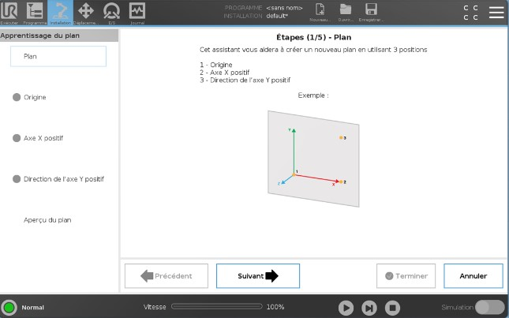
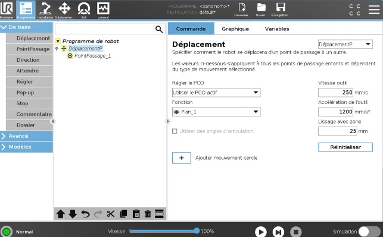
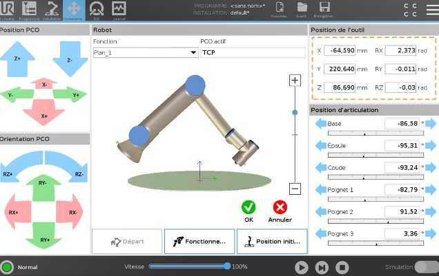

# **Robotique & Cobotique**
## Contrôle et trajectoires avancés

## Objectifs

Dans ce TP vous découvrirez le principe de repère (Fonctions) vous permettant de créer des programmes plus durables.

- [x] Comprendre le principe des répères
- [x] Créer un programme relatif à un objet mobile
- [x] Utiliser un préhenseur à ventouse

## Matériel et logiciel nécessaire

- Robot Universal robot UR10-e series
- Parcours filoguidé
- Préhenseur OnRobot à ventouse

---

## Travaux Pratiques

Dans cette activité, vous allez découvrir des fonctionnalités plus avancées du Cobot UR10e.

Référez vous au TP1 pour la mise en route du robot.

Pour commencer votre TP, ouvrez le programme que vous avez réalisé lors du premier TP. Tournez ensuite la tablette avec les parcours d'outils de 90 degrés.

Si vous démarrez maintenant votre programme, le robot ne "sait" pas que vous avez déplacé la tablette et il ne suit plus les trajectoires correctement.

Pour corriger cela, vous devez créer un nouveau repère de référence qui pourra être déplacé ultérieurement. Dans le vocabulaire du robot, ces références sont appelés "Fonctions" à ne pas confondre avec des fonctions mathématiques ou des sous-programme. Les fonctions sont en quelque sorte la définition géométrique d'un élément comme un point, un plan ou une droite.

Nous devrons ensuite recréer notre programme en utilisant les fonctions comme référence. De cette façon, nous pourrons déplacer le repère plutôt que de déplaccer la totalités des points du programe.

Pour commencer le TP assurez vous d'avoir configurer un PCO (TCP) ainsi que son orientation. Référez vous au TP1 si ce n'est pas le cas.

### Création d'un plan de référence :

1. **Ouverture du programme précédent :**
   - Ouvrez le logiciel de programmation Polyscope sur la tablette de contrôle (Teach Pendant).
   - Chargez le programme que vous avez réalisé lors du premier TP.

2. **Définition d'un nouveau repère de référence :**
   - Allez dans l'onglet `Installation` sur la tablette de contrôle.
   - Sélectionnez `Fonctions` puis `Plan`.
   - Nommez ce repère `Plan_Tablette` en cliquant sur le crayon 
   - Cliquer ensuite sur `Enseigner le plan` pour ouvrir l'utilitaire de plan.
   - Suivez les instructions

   

3. **Utilisation du nouveau repère dans le programme :**
   - Retournez à l'onglet `Programme`.
   - Modifier vos déplacement de façon à changer la fonction de référence (de `base` à `Plan_Tablette`)

   

   - Maintenant vous pouvez corriger vos point de passage (`Waypoints`) en les redéfinissant complètement puisque l'on a changer leur repère.

!!! info "Astuce"
   Maintenant vous pouvez controller le robot relativement à votre fonction `Plan_Tablette`.
   Ce qui signifie que dans l'onglet `Mouvements` vous pouvez aussi changer la fonction de référence pour faciliter la programmation.
   

   - Tester maintenant votre programme sur un plan horizontal.
   - Inclinez maintenant le plan et redéfinissez une nouvelle fonction de référence.
   - Validez votre programe avec le profésseur

---

### Installation d'un préhenseur à ventouse

1. **Configuration du préhenseur à ventouse :**
   - À l'aide des outils, démonter l'outil actuel pour installer le changeur rapide OnRobot.

<iframe width="580" height="326" src="https://www.youtube.com/embed/GnFETVbVFW8" title="Tuto : Comment installer le préhenseur magnétique MG10 OnRobot sur un cobot Universal Robots ?" frameborder="0" allow="accelerometer; autoplay; clipboard-write; encrypted-media; gyroscope; picture-in-picture; web-share" referrerpolicy="strict-origin-when-cross-origin" allowfullscreen></iframe>

   - Afin d'activer l'outil rendez-vous dans l'onglet `Installation`, puis `URCaps`.
   - Selectionnez le préhenseur `VGC10`

   {.img-small}

   - Vous pouvez maintenant créer un nouveau programme pour tester le préhenseur à ventouse
   - Rapprochez vous du professeur pour validation

---

### Liste de Tâches :

#### Plan de référence 

- [ ] Ouvrir le programme précédent
- [ ] Créer un nouveau repère de référence (`Plan_Tablette`)
- [ ] Définir les coordonnées du nouveau repère
- [ ] Modifier les points de passage pour les rendre relatifs au nouveau repère
- [ ] Configurer le préhenseur à ventouse
- [ ] Tester et ajuster le programme
- [ ] Exécuter le programme sur le robot
- [ ] Appeler le professeur pour validation

En suivant ces étapes, vous apprendrez à créer des programmes plus robustes en utilisant des repères de référence, et à manipuler des objets avec précision grâce à l'utilisation du préhenseur à ventouse. Bonne chance !

#### Suivi de ligne

- [ ] Créer un point de référence `origin`
- [ ] Créer un plan de référence
- [ ] Installer l'outil de suivi de ligne (en forme de C )
- [ ] Programmer le suivi de ligne
- [ ] Rapprochez vous du professeur pour validation

#### Préhenseur à ventouse

- [ ] Démonter le préhenseur d'apprentissage
- [ ] Installer le support d'outil OnRobot
- [ ] Programmer la préhension du carton

