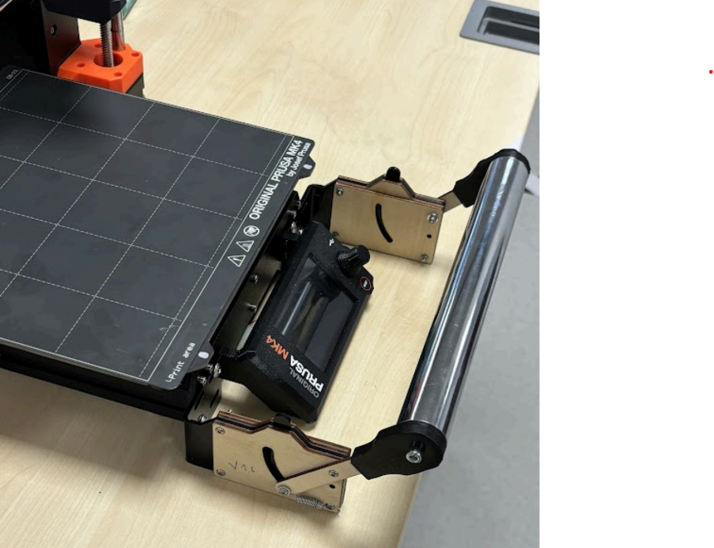

# Actionneur pour decoller les plateaux des imprimantes 3D

## Lien du projet [ici](https://cloudlasalle-my.sharepoint.com/:f:/g/personal/sonia_lahleb_unilasalle_fr/EnbiEOyM6DdCuoXopplIr6wBtv4qji5Tv2g2f2S-w8dTfw?e=MyXSno)

## Contributeurs au projet

   1. Rémi Lacombe
   2. Arthur Robert
   3. Baptiste Renoult